# Code Reduction Audit

Repository: `Blummer92/agent-os` (https://github.com/Blummer92/agent-os)
Base branch: `main`
Audit timestamp: 2026-10-03T22:40:17Z (start) → 2026-10-03T23:08:29Z (final verification; see §29)
Baseline SHA: `2a77dad5c1401271bf7ccc3c006d51fb8996423a`
Final verification SHA: `2a77dad5c1401271bf7ccc3c006d51fb8996423a`
Main movement: none (`origin/main` re-fetched before finalization: `2a77dad5…` → `2a77dad5…`)
Audit mode: Read-only

> **Status of this document.** This is an audit recommendation, not a record of
> implementation. No file was deleted, moved, migrated, merged, or deployed. The
> only repository change made by the audit is the creation of this file, which is
> left uncommitted. Every recommendation below still requires its own
> issue-linked authorization under `01_Shared_Standards/github/safe-implementation-lane.md`;
> workflow, protected-setting, packaging-for-production, cloud, Notion, and Drive
> changes remain excluded surfaces under
> `01_Shared_Standards/github/excluded-surface-baseline.md`.

---

## 1. Executive summary

### Conclusion

Agent OS does have duplicate and stranded responsibilities, but far fewer *true*
duplicates than raw similarity suggests. Most apparent duplication (134 files
with canonical-JSON serializers, 62 SHA-40 validators, three readiness enums,
five evidence stores) is either intentionally owner-local under ADR-0003 and
#1733 or is an explicit, mapped projection — those are **do-not-touch**. The real
reduction value sits in three places: (1) **retirement residue** left behind when
#3101 removed GCE-era entrypoints (#3233/#3235) but not their helpers, native C
extension, vocabulary, ingress selector, and docs; (2) **contract-first staging
whose consumer never arrived or was cancelled** — 164 production files /
35,480 LOC (21% of production Python) are unreachable from any entrypoint, CI or
hook target, console script, or the MCP server; and (3) **registry
restatement** — ownership and alias facts stated in several unvalidated tables
that have already drifted (18 retired-agent references in the capability
registry). An evidence-backed safe-deletion set exists today (≈1,950 production
LOC + ≈1,260 test LOC, all R0–R1); a larger consolidation set (≈1,700 further
production LOC) needs bounded migrations; and ≈4,000 further production LOC are
blocked on owner decisions already tracked in #3101, #3085, #2281, #240, and #736.

### Highest-value reductions

1. **TOP-001 / FND-001** — Retire the first-run validation residue orphaned by PR #3233 (6 modules, 846 prod LOC, ≈640 test LOC, a still-accepted `/agent-os validate-first-run` selector that always fails closed downstream); R1 / Strongly supported.
2. **TOP-002 / FND-002** — Remove the `clone3` launcher and the repository's only C extension, orphaned by PR #3235; the Workflow Scheduler wheel becomes pure-Python; R1 / Confirmed.
3. **TOP-003 / FND-011** — Retire the unconsumed parallel batch merge/validation coordinator (#3085), including two modules #3085's consumer trace missed (`pr_batch_merge_plan.py`, `zero_job_validation_recovery.py`); 890 prod / 1,192 test LOC; R2 / Strongly supported.
4. **TOP-004 / FND-004** — Delete the shadow `scripts/agent_os_grading_decision` contract, which mints the same `grading-decision:<sha256>` identity namespace as canonical WS-GRADE1 over a different payload, before open #1132 binds to it; R1 / Confirmed.
5. **TOP-005 / FND-007** — Retire the deprecated `NotionReadOnlyConnector` fixture shim; today a dedicated CI workflow runs *only* the shim's test and the capability registry names the shim as a canonical path owned by a retired agent; R3 / Strongly supported.

### Safe now vs. migration first

- **Safe deletion (R0–R1):** SD-001 … SD-007 (§22).
- **Migration required (R1–R3):** CM-001 … CM-013 (§23).
- **Do not touch:** DNT-001 … DNT-015 (§24).
- **Unresolved (R4, no reduction recommended yet):** FND-014, FND-015, FND-024, FND-028 (§27).

---

## 2. Baseline

| Field | Evidence |
|---|---|
| Audit timestamp | 2026-10-03T22:40:17Z (`date -u`) |
| Repository | `https://github.com/Blummer92/agent-os` (`git remote -v`) |
| Branch | `main` (`git branch --show-current`) |
| Baseline SHA | `2a77dad5c1401271bf7ccc3c006d51fb8996423a` (`git rev-parse HEAD`) |
| Final verification SHA | `2a77dad5c1401271bf7ccc3c006d51fb8996423a` (`git fetch origin main` → `FETCH_HEAD`, re-checked at finalization) |
| Main movement | None |
| Worktree state at start | Clean (`git status --porcelain` empty). Untracked `__pycache__/` directories exist but are git-ignored (0 tracked). |
| Pre-existing vs audit changes | Pre-existing: none. Audit-created: `CODE-REDUCTION-AUDIT.md` only (untracked). Analysis scripts lived only in the session scratchpad. |
| Clone depth | Shallow, 50 commits (`git rev-parse --is-shallow-repository` = true). Deeper lineage came from GitHub issue/PR history (EV-006 … EV-009). |
| Size | 2,312 tracked files; 1,395 Python modules (583 production / 812 test); 168,783 production Python LOC; 189,720 test Python LOC; ≈22,480 TS/JS/MJS/GS LOC; ≈38,600 Markdown lines |

### Governance reviewed (index; detail in §3)

`AGENTS.md`, `CLAUDE.md`, `00_Governance/ownership-and-source-of-truth.md`,
`00_Governance/write-authorization-policy.md`,
`00_Governance/architecture-decisions/adr-0003-no-shared-discovery-or-validation-primitive-abstraction.md`,
`adr-0004-hosted-bridge-runtime-non-authority.md`,
`00_Governance/engineering-agent-consolidation-review.md`,
`04_Registry/{agent-inheritance-registry,responsibility-matrix,ownership-matrix,legacy-agent-alias-registry,alias-and-deprecation-map,agent-loadout-matrix,task-routing-guide,risk-owner-map,agent-risk-tiers,reusable-capabilities.yml,navigation-alias-registry}.md`,
`02_Agent_Overlays/github-service-agent.md`,
`01_Shared_Standards/github/{safe-implementation-lane,excluded-surface-baseline,asset-content-identity-contract}.md`,
`docs/canonical-json-classification.md`, `07_Agent_Tests/validate_registry_consistency.py`.

---

## 3. Governance reviewed

### Phase 0 — Confirmed scope, authorization, and read-only constraints

| Item | Record |
|---|---|
| Scope | Current `main` only, at the baseline SHA. Whole repository; Python import/reachability analysis covers all 1,395 Python modules. Non-Python code is listed in §4 "Areas not inspected". |
| Authorization | Explicit user instruction to perform a read-only audit and create only `CODE-REDUCTION-AUDIT.md`. |
| Read-only mode | Confirmed. No deletes, edits, migrations, merges, deployments, workflow/setting/credential changes, Notion/Drive writes, GitHub writes, or commits. GitHub was used read-only (issue reads/search). |
| Authorization limitation | The `UserPromptSubmit` governed-route preflight returned `status=needs-decision (ambiguous-issue-reference)`: there is no issue-linked lineage for this audit. Therefore the report file is **not committed or pushed**; publishing it to the repository requires a separate issue-linked GitHub Service Agent route. |
| Deviations | None. |

### Negative-rule checklist (applied in every later phase)

- [x] No abstraction proposed solely to remove duplicated code (FND-016 explicitly rejects one).
- [x] Different authority boundaries not consolidated (DNT-010, FND-021).
- [x] No compatibility removal without a migration/removal condition (CM table).
- [x] No test deletion recommended to reduce LOC; tests are removed only with their subject (TD-001).
- [x] Generated files, comments, and documentation removal are **not** counted as architectural reduction (doc lines reported separately).
- [x] No generic framework proposed (ADR-0003 respected).
- [x] No new registry proposed.
- [x] Not a style cleanup.
- [x] No micro-performance work recommended.
- [x] Old ≠ obsolete: each candidate carries consumer and lineage evidence.
- [x] Similar ≠ duplicate: FND-026/027/028 and DNT table record intentional separation.
- [x] Unused internal imports ≠ no external consumer: wheel-packaged candidates carry a runtime-closure prerequisite (R-001).
- [x] No production modification.

### Governance summary

- **Source of truth:** GitHub `main` (AGENTS.md, CLAUDE.md). Executable code is stronger evidence than documentation (workflow instruction), and current governance is authoritative for ownership boundaries.
- **Ownership:** Repository implementation and GitHub writes → GitHub Service Agent; validation evidence → QA / Test Agent; cross-system, registry, and reusable-capability routing → ChatGPT Orchestrator (`agent-inheritance-registry.md`, `responsibility-matrix.md`). `Integration Manager` and `Google Workspace Automation Engineer` are retired (`engineering-agent-consolidation-review.md`, #1324).
- **Write authorization:** Default read-only; excluded surfaces (workflows, protected settings, credentials/IAM, production, external writes, governed fields, persistence-path changes) need their own authorization (`write-authorization-policy.md`, `excluded-surface-baseline.md`).
- **Reduction-specific governance found:**
  - ADR-0003 rejects a shared discovery core, `IdentityCollision`, universal `DiscoveryResult`, and a shared scalar-validation package, with reconsideration triggers.
  - #1733 (`docs/canonical-json-classification.md`) forbids canonical-JSON consolidation without byte-equivalence and identity proofs.
  - #2502 Retirement Gate and #2772 Retirement discipline: lifecycle classes `ACTIVE-RUNTIME / STAGED-BUT-REQUIRED / SUPERSEDED / ABANDONED / HISTORICAL-ONLY / NEEDS-DECISION`; zero imports alone is insufficient; installed-wheel runtime closure must be checked for packaged modules.
  - AGENTS.md step 13: persisted reduction inventories must be reconciled against current `main` before reuse (applied in §6, EV-008).
  - Active owners for overlapping reduction work: #1729 (backlog/code reduction audit, open), #2772 (compatibility-wrapper retirement, auto-closed after Wave 1 via PR #3156), #3085 (batch family, open/needs-decision), #3101 (GCE-RETIRE3, open/ready), #3099 (GCE inventory, open), #3100 (browser capture), #3102 (final VM deletion), #2281 (consumer of `classify_recovery_progress`), #240 (Cloud Build), #736 (Visual Asset Sync live sync).

This audit **does not create a competing reduction campaign**: every recommendation that falls inside one of those owners' scope is routed to that owner (§28).

### Decision gate 0 / 1

Pass. Scope and authorization are explicit; read-only is confirmed; negative rules
are recorded; baseline SHA and branch are recorded; governance is identified;
pre-existing and audit-created changes are distinguishable.

---

## 4. Method and evidence standards

### Duplication taxonomy (Phase 2)

| Code | Type | Meaning in this audit |
|---|---|---|
| T-TXT | Textual duplication | Same or near-same source text (e.g., FND-016). |
| T-BEH | Behavioral duplication | Different code, same observable behavior for the same inputs. |
| T-RESP | Responsibility duplication | Two owners claim the same responsibility (e.g., FND-004, FND-014). |
| T-REP | Representation/schema duplication | Two models/vocabularies for one concept (e.g., FND-019, FND-018). |
| T-EXEC | Execution-path duplication | Two routes to perform one operation (e.g., FND-025). |
| T-VAL | Validation duplication | Two validators/gates for one invariant (e.g., FND-015). |
| T-REG | Registry duplication | One fact maintained in several registries (FND-008/009/010). |
| T-ADP | Adapter duplication | Two adapters to one provider/transport (FND-021). |
| T-PER | Persistence duplication | Two writers to one governed store (FND-014). |
| T-CMP | Compatibility duplication | Old and new contracts kept side-by-side (FND-007, FND-018). |
| T-TST | Test-infrastructure duplication | Tests protecting the same boundary or only obsolete code (TD table). |

### Evidence standards

| Evidence | Method | Strength / limitation |
|---|---|---|
| Import graph (EV-003) | AST parse of all 1,395 tracked `.py` files; module names resolved per source root (`08_Tooling/*/src`, `src/`, `scripts/`); relative imports resolved; `importlib.import_module("…")` literals and quoted dotted names in production files counted as edges (captures lazy `__init__` export maps). | Strong for static imports. Misses computed dynamic imports and off-repository consumers. |
| Strict reachability (EV-004) | Roots = 69 modules: `__main__` guards, files referenced **by path or dotted name** from `.github/`, `.claude/`, `.githooks/`, `.devcontainer/`, `*.sh`, `cloudbuild*.yaml`, host install scripts; `[project.scripts]` console scripts; `agent_os_execution_service.mcp_server`. BFS over import edges plus parent `__init__`. Bare leaf-word matches (e.g., `report`, `routing`) were **discarded** as noise after manual review. | Strong lower bound on "no production root". Not proof of no consumer: agent-invoked use (e.g., via the ChatGPT checkout package) and off-repository imports of wheel-packaged modules remain possible. |
| Packaging boundary (EV-005) | Read every `pyproject.toml` to determine which modules ship in a wheel. | Wheel-shipped modules need an installed runtime-closure probe (#2772 Wave 0 method) before deletion. |
| Lineage (EV-006 … EV-009) | GitHub issues/PRs/comments read via the GitHub MCP connector; commits `ada16dc`, `b9a8bac`, `e36089b` diffs. | Authoritative for intent and prior dispositions; mutable facts reacquired 2026-10-03. |
| Governance text | Standards, overlays, registries, ADRs. | Authoritative for boundaries; treated as evidence to investigate, not proof of use. |
| Text search | `git grep`/`grep` across tracked files. | Used for doc/registry/workflow references. |

### Candidate-classification rules (Decision gate 2)

A candidate entered the material inventory only with: a named responsibility, at
least one apparent owner, recorded duplication evidence, and an explicit statement
that similarity was not used as proof. Candidates that failed this (e.g.,
three Drive client `Protocol`s that look alike but cover different operations) are
recorded in §24 or §6 as excluded with reasons.

### Evidence limitations

- Static analysis cannot disprove off-repository direct imports of modules shipped in the `workflow-scheduler`, `agent-os-execution-service`, `instructional-workflow-contracts`, `agent-os-navigation-registry`, and other `08_Tooling` wheels.
- "Agent-invoked" consumers (code executed by ChatGPT/Claude sessions, including through `scripts/build-chatgpt-checkout-package.sh`) leave no repository trace; they are classified **Unknown** rather than absent.
- No runtime probe was executed (installing the wheels requires building the C extension and the `mcp` dependency); the runtime-closure probe is recorded as prerequisite R-001.
- Persisted host configuration, Scheduler SQLite rows, route-decision stores, and the live GCE host were not inspected (external/live state; #3099 owns the host inventory).
- Shallow clone limited local `git log` to 50 commits.

### Areas inspected (Phase 4)

Execution & continuation; developer execution surfaces (GCE, Codespaces, containment); validation (aggregate gate, exact-head, remote validation, lifecycle evidence, failure classification, Cloud Build); GitHub lifecycle (readiness, operational state, labels, merge authorization, batch family, transports); instructional materials/worksheet QA; visual-asset architecture (intake → routing → Drive → Notion, identity, sync); Notion integration; Drive integration; registries (`04_Registry/*`, `reusable-capabilities.yml`); schemas/models (readiness, issue state, authorization, identity, canonical JSON); persistence stores; leases; workflows; tests.

### Areas not inspected (with reasons)

| Area | Size | Reason |
|---|---|---|
| `08_Tooling/instructional-materials-coach/picture-perfect-coach` (TypeScript) | 89 files | Outside the Python import graph; separate `npm` toolchain and its own workflow. Not material to any Python finding. |
| `08_Tooling/instructional-materials-coach/capture/*.mjs` (GCE live-capture transport) | 24 files | Owned by #3100 (authenticated browser capture, GCE-RETIRE2); recommendations would duplicate that owner. |
| Apps Script (`*.gs`), `08_Tooling/workspace-automation-builder` | 5 files | No Python consumers; deployment surfaces are excluded. |
| `05_Examples/ui-cross-platform-reference` | ≈12 files | Example code, not runtime. |
| `00_Governance/documentation-dependency-map/*`, `CHANGELOG*.md`, `06_Archive/` | docs | Documentation; removal would not be architectural reduction. |
| Live GCE host, Notion workspace, Drive folders, Cloud Build project | external | Read-only repository audit; external-system reads not authorized. |

---

## 5. Responsibility map

`Duplicate status`: Confirmed = proven second owner; Partial = overlapping slice; Not duplicate = intentional separation; Unresolved = insufficient evidence.

| RM-ID | Responsibility | Canonical owner | Other implementations | Production consumers | Tests/fixtures | Schemas/state | Adapters/registries | Duplicate status | Evidence |
|---|---|---|---|---|---|---|---|---|---|
| RM-001 | Host continuation driving (finite transitions) | `scripts/agent_os_execution_interface/continuation_driver.py:drive_governed_continuation` | `workflow_scheduler/execution/continuation.py:plan_execution_continuation` (unreached; lease/ResumePlan admission, different responsibility) | `mcp_server.py`, `mcp_facade.py`, `bulk_repair_facade.py`, `issue_batch_completion.py`, `hook_adapter.py` | `tests/agent_os_execution_interface/*` | `ContinuationDecision` (two distinct dataclasses of the same name) | `.claude/settings.json` hook | Not duplicate (distinct layers); name collision only | EV-003, EV-007, EV-022 |
| RM-002 | Finite multi-PR/issue batch completion & merge | `finite_batch_admission.py`, `mission_completion_admission.py`, `issue_batch_completion.py`, per-PR `merge_authorization.py` | `batch_merge_execution.py`, `batch_exact_head_validation.py`, `batch_post_merge_reconciliation.py`, `pr_batch_merge_plan.py`, `zero_job_validation_recovery.py` (all unreached) | MCP server (canonical side only) | 8 batch test files (1,192 LOC) | `BatchMergeCursor` vs canonical per-PR state | — | Confirmed (#3085) | EV-021 |
| RM-003 | Developer-loop validation transport | `governance/dev_validation_codespaces.py` (preferred, #2299/#2931) | `governance/dev_validation_gce.py` (fallback); `first_run_dev_validation_gce.py` (orphan) | `agent-os-governed-invocation.yml` | scheduler + root tests | `DevValidationRequest` (shared) | `codespaces_first_route.py` | Confirmed parallel (intentional fallback under retirement, #3101) | EV-006, EV-012 |
| RM-004 | Process containment for governed execution | None (cgroup v2 containment retired by #3235) | `clone3_cgroup_launcher.py` + `_clone3_cgroup.c` (orphan); `process_group_containment.py` (#3200, unreached) | none | `test_clone3_cgroup_launcher.py`, `test_process_group_containment.py`, `test_host_packaging.py` | `delegated_parent_cgroup` config field (fail-closed) | `ExecutorCapability.CGROUP_V2_CONTAINMENT/CLONE3_INTO_CGROUP` | Unresolved (capability decision owned by #3101) | EV-010, EV-037, EV-038 |
| RM-005 | Executor route selection | `agent_os_execution_service/executor_routing.py` | `governed_runner_preference.py` (unreached; blocked by #2931) | execution-service | yes | `ExecutorRouteDecision` | `route_decision_store.py` | Not duplicate (ingress vs executor layer) | EV-007, EV-012 |
| RM-006 | Aggregate / exact-head validation gate | `.github/workflows/agent-os-validation.yml` + `scripts/agent_os_aggregate_gate.py` + `scripts/validate-all.sh` | `cloudbuild.yaml` (supplemental, runs the same `validate-all.sh`); Cloud Build Python provider/reporting/lease (unreached) | GitHub Actions | `tests/agent_os_cloud_build_*` (3,921 LOC) | `ValidationPlan` | `scripts/agent_os_ci_validation.py` | Partial / staged parallel (owner #240) | EV-028 |
| RM-007 | Validation-lifecycle evidence & supersession | `validation_lifecycle_evidence.py` | `validation_supersession.py` (unreached) | `authorized_validation_entrypoint.py` | yes | evidence bundle (remote_validation) | — | Unresolved | EV-004 |
| RM-008 | Validation-failure classification | `scripts/agent_os_issue_acceptance/validation_failure_classifier.py` (VD2, #988) | `scripts/agent_os_validation_failures` (VD1A, #1161; unreached) | `validation_supersession`, `coding_command_center_handoff`, `live_compute_control_binding`, `agent_os_release_run_core` | `tests/agent_os_validation_failures/test_core.py` | two record schemas | — | Confirmed obsolete second representation | EV-015 |
| RM-009 | Issue readiness | `scripts/agent_os_issue_acceptance/readiness.py:evaluate_issue_readiness` | projections `ReadinessState`, `IssueReadinessStageStatus` | 13 production importers | yes | three enums, explicit maps | — | Not duplicate (mapped projections) | EV-026 |
| RM-010 | Issue/job lifecycle state | `issue_operational_state.py` (`LifecycleStage`, `ReadinessState`) | `workflow_scheduler/project_execution.py:JobStatus` (Phase-2 MVP, unreached) | 16 production importers (canonical) | `test_project_execution_mvp.py` | `JobStatus` duplicates queued/ready/blocked/validation/review states | — | Confirmed (obsolete) | EV-030 |
| RM-011 | Merge authorization | `merge_authorization.py` | `merge_authorization_source.py` (#2869, unreached); batch coordinator | `issue_operational_state.py` et al. | yes | content-bound records | — | Partial | EV-003 |
| RM-012 | GitHub REST transport | `scripts/agent_os_github_issue_provider/request.py:request_json` | `urllib` in `github_ruleset_admin_adapter.py` and `agent_os_mission_reliability/__main__.py` | 7 importers of canonical | yes | — | Scheduler adapter registry | Confirmed (minor) | EV-032 |
| RM-013 | PR lifecycle labels | Retired as required state (#2904) | `workflow_scheduler/adapters/github_pr_label_adapter.py` (generic label-add, registered as `github_pr_label`) | adapter registry only; no in-repo task definition uses it | 2 bug-regression tests | — | `adapters/registry.py` | Unresolved | EV-031 |
| RM-014 | Scheduler adapter input contract | `workflow_scheduler.models.ExecutionRequest` | legacy `Task` input; `request_compat.py` + `request_dispatch._ExecutionRequestBridge` | `cli.py` uses `request_dispatch.Executor` | adapter tests | two input contracts | 5 adapters still `accepts_execution_request=False` | Confirmed (incomplete migration) | EV-029 |
| RM-015 | Notion read & normalization | live: `workflow_scheduler/adapters/notion_readonly_adapter.py`; normalize: `navigation_registry/connectors/notion_contract_adapter.py`; cached index: `08_Tooling/notion-navigation-client` | `navigation_registry/connectors/notion.py:NotionReadOnlyConnector` + `notion_normalizer.py` (self-declared deprecated shim) | shim: package re-export only | shim test is the **only** test run by `navigation-registry-offline-tests.yml` | `RegistryResource` | `reusable-capabilities.yml` `readonly-connector-contract` | Confirmed (compat shim) | EV-017 |
| RM-016 | Visual Asset Library governed Notion writes | `08_Tooling/visual-asset-notion-writer` (#959) | `src/visual_asset_sync/mutation_adapter.py` + `orchestration.py` (#739) | neither has a production caller | 360 LOC (sync) | different identity keys (`asset_id`+`drive_file_id` vs planner identity key) | — | Unresolved (#736 open) | EV-023 |
| RM-017 | Visual asset identity | logical: `instructional_workflow_contracts/reusable_visual_identity.py`; content: `asset_content_identity.py` (#3256) | intake SHA-256 (`visual-asset-intake`), sync identity key, Notion `asset_id` | `asset_content_identity` has 5 consumers; logical issuer is test-only but **designated canonical** | yes | governed contracts | `asset-content-identity-contract.md` | Not duplicate (layered; active program) | EV-024 |
| RM-018 | Grading decision | `scripts/agent_os_work_scanner/grading_decision.py` (WS-GRADE1, #1127) | `scripts/agent_os_grading_decision/contract.py` (no issue, no docs) | reader + two adapters (canonical) | 51 LOC (shadow) | both mint `grading-decision:<sha256>` | — | Confirmed (shadow) | EV-014 |
| RM-019 | Rendered worksheet layout QA | `08_Tooling/instructional-materials-coach/.../worksheet_layout_qa.py` | `src/worksheet_layout_qa/pagination_balance.py` (#2735) | neither wired into build | 212 + 149 LOC | two rubric dimensions | same package/module name | Partial (fragmented ownership) | EV-035 |
| RM-020 | Ownership/responsibility registry | `04_Registry/responsibility-matrix.md` (validated) | `ownership-matrix.md` (unvalidated restatement); `reusable-capabilities.yml` owner fields | agents (read) | `07_Agent_Tests/validate_registry_consistency.py` | Markdown tables | — | Confirmed (ownership-matrix); drift (capabilities) | EV-018, EV-020 |
| RM-021 | Legacy alias resolution | `04_Registry/legacy-agent-alias-registry.md` (validated) | `alias-and-deprecation-map.md` (0 inbound refs), `engineering-agent-consolidation-review.md` (decision record) | agents | validator | Markdown | — | Confirmed (alias map) | EV-019 |
| RM-022 | Canonical JSON / identity serialization | owner-local per #1733 | 134 production files | many | many | identity domains | — | Not duplicate | EV-025 |
| RM-023 | Evidence persistence | `scripts/agent_os_execution_checkpoint/store.py` | 5 stores reuse it | execution-service | yes | content-addressed JSON | — | Not duplicate (healthy reuse) | EV-027 |
| RM-024 | Scheduler lease | `host_local_lease_adapter.py` | `in_memory_lease_adapter.py` (pilot/test), `cloud_build_lease_lifecycle.py` (unreached) | `concrete_runtime_adapters`, `production_host_composition`, `invocation_reconstruction` | yes | lease records | — | Partial | EV-028 |
| RM-025 | Drive access | IMC `drive_client.py` (live) | `bounded_drive_lookup.py`, `classroom_workspace_drive_adapter.py`, `visual-asset-drive-writer` (operation-specific Protocols) | IMC CLI | yes | — | — | Not duplicate (interface segregation) | EV-003 |

### Unresolved ownership questions

1. Is #759 containment `RETIRE_CAPABILITY` or `KEEP_GCE_BLOCKER`? (#3101) — governs RM-004.
2. Is the Sheets → Notion Visual Asset Sync (#739/#736) still a required migration path, or has the per-asset writer (#959) superseded it? — governs RM-016.
3. Does #240 still intend a Python Cloud Build provider/reporting runtime? — governs RM-006.
4. Which live owner should carry the #1251 bounded red-CI alternate-diagnosis rule? — governs FND-012.
5. Does any scheduled/persisted task definition still use the `github_pr_label` adapter name after #2904? — governs RM-013.

---

## 6. Duplicate-responsibility map

| Group | Canonical owner | Competing owner(s) | Shared responsibility | Material behavioral differences | Consumer overlap | Initial reduction hypothesis | Evidence |
|---|---|---|---|---|---|---|---|
| DR-1 Grading decision | WS-GRADE1 `work_scanner/grading_decision.py` | `agent_os_grading_decision/contract.py` | portable grading decision + deterministic ID | different identity model (`IdentityResolution` + confidence vs `stable_id/source/revision`), score typing (Decimal vs float 0–100), same ID prefix with different payload | none (shadow has no consumer) | delete shadow | EV-014 |
| DR-2 Validation failure facts | VD2 classifier (+ lifecycle evidence) | VD1A `agent_os_validation_failures` | normalized failure record | VD1A projects provider evidence into a record; VD2 classifies PR vs main vs infra; VD2 never consumed VD1A | none | delete VD1A (intended consumer #695 closed not-planned) | EV-015 |
| DR-3 Batch merge/validation | per-PR canonical owners | batch coordinator family | exact-head validation, merge sequencing, post-merge reconciliation | coordinator re-projects state decided by canonical owners; zero-job recovery (#2731) exists **only** here | none (batch has no host caller) | retire family after invariant mapping (#3085) | EV-021 |
| DR-4 Job lifecycle | `IssueOperationalState` | `project_execution.JobStatus` | issue/job status vocabulary | MVP is simulation-only Phase-2 model | none | delete MVP | EV-030 |
| DR-5 Notion read connector | contract adapter + live adapter + nav client | `NotionReadOnlyConnector` | Notion resource lookup | shim reads fixtures only | registry & CI only | redirect registry, delete shim, retarget CI | EV-017 |
| DR-6 Ownership table | `responsibility-matrix.md` | `ownership-matrix.md` | responsibility → owner | 10/23 identical rows; 13 paraphrased keys; 0 owner conflicts today; only one is validated | readers of both | fold into responsibility-matrix | EV-018 |
| DR-7 Alias/retirement facts | `legacy-agent-alias-registry.md` | `alias-and-deprecation-map.md` | retired-role resolution | none material | none | delete orphan map | EV-019 |
| DR-8 VAL Notion writes | (unresolved) #959 writer | #739 sync mutation adapter | governed create/update of VAL pages with retry and ambiguous-create reconciliation | bulk planner-driven vs per-asset; different identity keys | none live | defer to #736 | EV-023 |
| DR-9 Validation provider | GitHub Actions gate | Cloud Build Python provider/reporting | exact-SHA validation evidence & PR reporting | Cloud Build is supplemental; Python provider not wired | none | defer to #240 | EV-028 |
| DR-10 Worksheet layout QA | IMC QA modules | `src/worksheet_layout_qa` | rendered worksheet whitespace defects | different rules (role-based dead space vs next-block pagination) | none | co-locate, do not merge rules | EV-035 |
| DR-11 Adapter input | `ExecutionRequest` | legacy `Task` | Scheduler adapter input | bridge converts Task → ExecutionRequest | 5 legacy adapters | migrate adapters, remove bridge | EV-029 |
| DR-12 Dev-validation transport | Codespaces | GCE fallback | developer-loop validation | GCE carries VM-only capabilities | governed-invocation workflow | defer to #3101/#3102 | EV-006, EV-012 |

**Reconciliation of persisted inventories (AGENTS.md step 13).** #1729's 2026-09-18
candidate list was reconciled against current `main`:
`validation_route_preference.py`, `open_bug_candidate_selection.py`,
`draft_pr_materialization_admission.py`, `batch_readiness_body_drift.py`,
`lifecycle_drift_scan.py`, `recoverable_reconciliation.py` are **absent** →
HISTORICAL-ONLY, excluded. Surviving #1729 candidates
(`connector_native_fast_track`, `governed_handoff_publication`,
`governed_runner_preference`, `validated_workspace_continuation`,
`batch_body_normalization_plan`, `batch_repair_regression_admission`,
`coding_cockpit_view`, `documentation_gap_report`, `sprint_evidence_ingestion`)
keep their #2772 dispositions (FND-013) or enter the FND-024 population.

---

## 7. Shadow capabilities

| SC-ID | Old path | Canonical path | Shared responsibility | Behavioral differences | Consumers | Reachability | Risk | Confidence | Recommendation | Evidence |
|---|---|---|---|---|---|---|---|---|---|---|
| SC-001 | `scripts/agent_os_grading_decision/contract.py:build_grading_decision` | `scripts/agent_os_work_scanner/grading_decision.py:GradingDecision` | grading decision + identity | see DR-1; **same ID prefix** | tests only (1 file, 51 LOC); not in any wheel; no docs/registry | unreachable | R1 | Confirmed | Delete | EV-014 |
| SC-002 | `scripts/agent_os_validation_failures/core.py` | none needed (obsolete: intended consumer #695 closed not-planned); live classification = `validation_failure_classifier.py` | validation-failure facts | not equivalent; obsolescence, not replacement | tests only (240 LOC); not in any wheel | unreachable | R1 | Strongly supported | Delete | EV-015 |
| SC-003 | `src/navigation_registry/connectors/notion.py:NotionReadOnlyConnector` (+`notion_normalizer.py`) | `notion_contract_adapter.py`, `notion_readonly_adapter.py`, `08_Tooling/notion-navigation-client` | Notion resource lookup | fixture-only, deprecated by its own docstring | package re-export; 1 test; 1 CI workflow; 1 registry entry | test-only | R3 | Strongly supported | Redirect, then Delete | EV-017 |
| SC-004 | `workflow_scheduler/project_execution.py` | `issue_operational_state.py` + `single_issue_pilot.py` | issue-as-job lifecycle | simulation-only MVP | 1 test (471 LOC); roadmap doc | unreachable | R2 | Strongly supported | Delete (update roadmap note) | EV-030 |
| SC-005 | batch family (5 modules) | per-PR canonical owners (#3085 list) | batch merge/validation | coordinator projection; unique zero-job invariant | tests only | unreachable | R2 | Strongly supported | Delete after invariant mapping | EV-021 |
| SC-006 | `src/visual_asset_sync/mutation_adapter.py` | unresolved (#959 writer?) | VAL writes | see DR-8 | tests only | unreachable | R4 | Unresolved | Defer | EV-023 |
| SC-007 | Cloud Build Python provider/reporting | GitHub Actions Validation Gate | validation evidence/publication | supplemental provider | tests only | unreachable | R4 | Plausible | Defer (#240) | EV-028 |
| SC-008 | `08_Tooling/dashboard-migration-verification/scripts/dashboard_migration_common.py` | local helpers inside the same scripts | JSON/YAML helpers | scripts redefine `load_json`/`write_json` locally | **none, including tests** | dead | R0 | Confirmed | Delete | EV-016 |

---

## 8. Parallel architectures

1. **GCE vs Codespaces developer execution (RC-001; FND-025, FND-001, FND-002, FND-003).** Codespaces is preferred for ordinary developer-loop work (#2299/#2931); GCE remains required for runtime inspection, ruleset admin, first-publication activation, PPUX projection, Notion read, and generic governed control (`codespaces_first_route.GCE_REQUIRED_REASONS`). The GCE side is under an active retirement campaign (#3101/#3099/#3100/#3102). This audit adds only the **residue** left by the already-merged #3233/#3235 removals and routes everything else to #3101.
2. **Host continuation driver vs Scheduler continuation planners (RC-002; FND-012).** `continuation_driver.py` is the live owner; `continuation.py` + `red_ci_continuation.py` are unconsumed but carry live invariants (#2772 2026-09-28/30 dispositions).
3. **Per-PR canonical lifecycle owners vs batch coordinator (RC-002; FND-011).** Owned by #3085.
4. **GitHub Actions gate vs Cloud Build Python provider (RC-004; FND-015).** Owned by #240.
5. **Two Visual Asset Library writers (RC-004; FND-014).** Owned by #736/#959 lineage.
6. **Two grading-decision contracts (RC-004; FND-004).** Shadow has no lineage.

---

## 9. Dead-code candidates

| UR/ID | Candidate | Evidence | Disposition |
|---|---|---|---|
| FND-006 | `dashboard_migration_common.py` (123 LOC) | zero importers anywhere, including tests; only mentioned in `docs/directory_structure.md` | SD-001 |
| FND-004 | `scripts/agent_os_grading_decision/` (125 LOC) | unreachable; no wheel; no docs/registry | SD-002 |
| FND-005 | `scripts/agent_os_validation_failures/` (390 LOC) | unreachable; no wheel; consumer cancelled | SD-003 |
| FND-001 | first-run residue (6 modules, 846 LOC) | only consumer deleted by PR #3233 (EV-009) | SD-004 |
| FND-002 | `clone3_cgroup_launcher.py` + `_clone3_cgroup.c` (471 LOC) | only consumer removed by PR #3235 (EV-010) | SD-005 |
| FND-019 | `project_execution.py` (498 LOC) | unreachable; Phase-2 MVP | CM-008 (roadmap doc reference) |

---

## 10. Compatibility-retirement candidates (migration scaffolding)

| MF-ID | Candidate | Original purpose | Current consumers | Migration complete? | Reachable branches | Required behavior | Removal condition | Risk | Confidence | Recommendation | Evidence |
|---|---|---|---|---|---|---|---|---|---|---|---|
| MF-001 | `github_issue_comment_ingress.py` `/agent-os validate-first-run <sha>` selector (`_FIRST_RUN_VALIDATION_RE`, `accepted-first-run-validation-envelope`, trigger-id helper; 12 matching lines) | #1972 first-run trigger | governed-invocation workflow parses comments | Yes (#3233 retired the transport) | accepted → `codespaces_first_route` → `preferred="none"` → fail closed | fail closed (preserve) | ingress rejects the selector directly; route test updated | R2 | Strongly supported | Remove | EV-013 |
| MF-002 | `delegated_parent_cgroup` field (`runtime_configuration.py`, `production_host_bootstrap.py`, `production_host_state_sources.py`) | #759 cgroup containment input | config shape; fail-closed raise in `concrete_runtime_adapters.py:728-734` | Yes for code; unknown for persisted host configs | configured → raise | must keep failing closed while configs may carry it | #3099 proves no host config sets it, then remove field | R3 | Strongly supported | Retain → Remove later | EV-038 |
| MF-003 | `ExecutorCapability.CGROUP_V2_CONTAINMENT` / `CLONE3_INTO_CGROUP` | routing vocabulary | `governed_runner_preference.py` (unreached) | Depends on #3101 #759 decision | no provider can satisfy | none if retired | #3101 decides RETIRE; persisted route decisions checked | R3 | Plausible | Defer | EV-037 |
| MF-004 | `request_compat.py` + `request_dispatch._ExecutionRequestBridge` + `accepts_execution_request` flag | Phase-4C Task→ExecutionRequest migration | `cli.py` Executor | No (5 adapters still on `Task`) | both | adapters receive one contract | all adapters accept `ExecutionRequest` | R2 | Strongly supported | Migrate | EV-029 |
| MF-005 | `NotionReadOnlyConnector` | fixture compatibility | registry, CI workflow, 1 test | Yes (docstring names canonical successors) | fixture lookup only | none | registry redirected, CI retargeted | R3 | Strongly supported | Remove | EV-017 |
| MF-006 | GCE fallback (`gce_fallback_allowed`, governed-invocation GCE steps, `gce_gcloud_adapter`, `dev_validation_gce`, …) | VM-only capabilities | live workflow | No | yes | preserve VM-only invariants until decided | #3101 decisions + #3102 deletion | R3 | Strongly supported | Defer (owner #3101) | EV-006, EV-012 |
| MF-007 | Stale docs for retired paths: `FIRST_RUN_VALIDATION_START.md` (describes removed `execute_transport` route), `FIRST_RUN_INVALIDATION_PROJECTION.md`, `AUTHORIZED_VALIDATION_RUNBOOK.md` step 2 (#759 cgroup preflight), `HOST_RUNTIME_INSTALLATION.md` `_clone3_cgroup` row | documentation | readers/agents | — | — | none | with SD-004/SD-005 | R1 | Confirmed | Remove/rewrite (doc hygiene; not counted as reduction) | EV-039 |
| MF-008 | `github_pr_label_adapter.py` after #2904 | managed PR labels | registry name only | Unknown | adapter resolvable by name | human labels still allowed | no persisted task uses `github_pr_label` | R3 | Plausible | Investigate | EV-031 |
| MF-009 | Root `FILE_MANIFEST*.md`, `FOLDER_TREE*.md` (6 files) | historical review package | none | Yes (self-declared historical) | — | — | move to `06_Archive/` | R0 | Confirmed | Archive (doc hygiene) | EV-043 |
| MF-010 | RC6 pilot runner (`agent_os_rc6_technical_pilot.py`, `agent_os_rc6_pilot_support.py`, `rc6-technical-pilot.yml`, frozen SHA `ca980c38…`) | RC6 three-person pilot | `workflow_dispatch` only | Pilot replaced by #1980 (closed) | manual dispatch | reproducibility of frozen evidence? | owner confirms no audit need to re-run | R3 | Plausible | Investigate | EV-034 |

---

## 11. Wrapper and adapter reduction

| WA-ID | Chain | Layer | Responsibility added | Forwarding only? | Consumers | Canonical replacement | Risk | Confidence | Action | Evidence |
|---|---|---|---|---|---|---|---|---|---|---|
| WA-001 | `cli.Executor` → `request_dispatch.Executor` → `_ExecutionRequestBridge` → `request_compat.build_execution_request_from_task` → adapter | bridge + compat | schema conversion | No (conversion) | CLI | direct `ExecutionRequest` | R2 | Strongly supported | Delete after CM-007 | EV-029 |
| WA-002 | `navigation_registry.connectors` → `NotionReadOnlyConnector` → `notion_normalizer` → `base` | shim | compatibility only | Yes (fixture passthrough) | registry/CI/test | `NotionContractAdapter` | R3 | Strongly supported | Redirect + Delete | EV-017 |
| WA-003 | `first_run_dev_validation_gce` → `dev_validation_gce` | observing wrapper | timing observation | No, but orphaned | none | none (capability retired) | R1 | Strongly supported | Delete (SD-004) | EV-009 |
| WA-004 | `clone3_cgroup_launcher` → `_clone3_cgroup` (C) | native wrapper | launch translation | No, but orphaned | none | none (capability retired) | R1 | Confirmed | Delete (SD-005) | EV-010 |
| WA-005 | `continuation_driver.completion_continuation_payload` → `continuation_payload` | helper | field defaults | Nearly | MCP, facades | — | — | — | Retain (live, 15 lines) | EV-003 |
| WA-006 | `scripts/agent-os-release-run.py` → `agent_os_release_run_core` | entrypoint | lifecycle-admission binding | No | operators | — | — | — | Retain | EV-003 |
| WA-007 | `visual_asset_ingestion_coordinator` → injected steps | coordinator | repair-state projection | No | none live | — | — | — | Retain (DNT-012) | EV-023 |

---

## 12. Duplicate schemas and models

| NS-ID | Concern | Implementations | Canonical owner | Behavioral differences | Identity drift? | Consumers | Net reduction | Risk | Confidence | Recommendation | Evidence |
|---|---|---|---|---|---|---|---|---|---|---|---|
| NS-001 | Canonical JSON | 134 production files with `sort_keys=True` + compact separators | owner-local (#1733) | `ensure_ascii` and domain prefixes differ | No (by design) | many | none | — | Not duplicate | Retain (DNT-001) | EV-025 |
| NS-002 | SHA-40 / bounded-text validators | 62 / 81 production files | owner-local (ADR-0003 §4) | known tab/LF/CR divergence handled as a bug, not extraction | No | many | none | — | Not duplicate | Retain (DNT-002) | EV-025 |
| NS-003 | `grading-decision:<sha256>` identity | WS-GRADE1 and shadow | WS-GRADE1 | different payload and domain separation under one prefix | **Yes** | WS-GRADE1 only | −176 LOC | R1 | Confirmed | Delete shadow (FND-004) | EV-014 |
| NS-004 | Visual asset identity | logical issuer, content identity, intake SHA-256, sync identity key, Notion `asset_id` | #3256 contract | layered by design | Monitored | in-flight #3252/#3254/#3257/#3258 | none | R4 | Not duplicate (governed) | Retain (DNT-005) | EV-024 |
| NS-005 | Readiness/issue state | `ReadinessOutcome`, `ReadinessState`, `IssueReadinessStageStatus`; `LifecycleStage` vs checkpoint `LifecycleState` | `readiness.py` / `issue_operational_state.py` | supersets with explicit maps | No | many | none | — | Not duplicate | Retain (DNT-003) | EV-026 |
| NS-006 | Job lifecycle | `project_execution.JobStatus` | `IssueOperationalState` | MVP-only vocabulary | Possible | none | −969 LOC | R2 | Strongly supported | Delete (FND-019) | EV-030 |
| NS-007 | Validation failure record | VD1A record vs VD2 classification | VD2 | different axes | No | VD2 only | −630 LOC | R1 | Strongly supported | Delete (FND-005) | EV-015 |
| NS-008 | Scheduler adapter input | `Task` vs `ExecutionRequest` | `ExecutionRequest` | conversion bridge | No | 5 + 9 adapters | ≈ −100 LOC, −1 contract | R2 | Strongly supported | Migrate (FND-018) | EV-029 |
| NS-009 | Drive file identity | `visual_asset_sync.normalize._DRIVE_FILE_ID_RE`, `bounded_drive_lookup.validate_stable_id`, drive writer evidence | context-specific | URL extraction vs exact ID validation | Unknown | various | none | — | Not material | Retain | EV-003 |

---

## 13. Duplicate validation

- **FND-015** — Cloud Build Python provider (`scripts/agent_os_cloud_build_provider`, 1,825 LOC), reporting (`scripts/agent_os_cloud_build_reporting`, 920 LOC), and `cloud_build_lease_lifecycle.py` (215 LOC) form a second validation-provider architecture beside the GitHub Actions gate; none has a production root; 3,921 test LOC. `cloudbuild.yaml` itself only runs `validate-all.sh` and does not use the Python provider. Owner #240 (risk-owner-map row "Validation-policy and Cloud Build drift", open). **R4 / Defer.**
- **FND-005** — VD1A failure projection vs VD2 classifier (above).
- **FND-011** — `batch_exact_head_validation.py` duplicates exact-head validation projection owned by canonical per-PR evidence (#3085).
- `validation_supersession.py` (402 LOC, unreached) overlaps `validation_lifecycle_evidence.py` terminal projection — **Unresolved**, part of FND-024 triage.
- Aggregate runner duplication was checked and **rejected**: `validate-all.sh` (local/Cloud Build), `agent-os-validation.yml` (Actions; uses `agent_os_ci_validation.py` + `agent_os_aggregate_gate.py`) share one command plan (`command_planning._COMMAND_REGISTRY`) — not duplicate.

---

## 14. Duplicate registries

| Finding | Registries | Evidence | Recommendation |
|---|---|---|---|
| FND-008 | `ownership-matrix.md` (23 rows) restates `responsibility-matrix.md` (25 rows): 10 identical keys/owners, 13 paraphrased keys, 0 owner conflicts; only `responsibility-matrix.md` is validated by `validate_registry_consistency.py`. Inbound refs to `ownership-matrix.md`: `documentation-dependency-map/lifecycle-governance.md:29`, ADR-0002 details-02 ("or its successor"), `06_Archive`. | EV-018 | CM-003: fold the 3 rows unique in meaning (rubric explanation-risk analysis; Teacher Decision Studio worksheet/PDF previews; Workspace/Apps Script validation evidence) into responsibility-matrix; repoint 2 references; retire ownership-matrix. |
| FND-009 | `alias-and-deprecation-map.md` restates `legacy-agent-alias-registry.md` + `engineering-agent-consolidation-review.md`; **zero** inbound references in tracked files. | EV-019 | SD-006. |
| FND-010 | `reusable-capabilities.yml` (17 capabilities) carries 18 references to retired `Integration Manager` / `Google Workspace Automation Engineer` as `owner_agent`/`supporting_agents`; the consistency validator deliberately does not read this file (#1511 comment). The `readonly-connector-contract` entry lists the deprecated shim as `canonical_paths` and only `known_consumers`. | EV-020, EV-017 | CM-004: redirect owner values to canonical agents (data correction, not a new registry); optionally extend the existing validator's retired-agent check to this file. |
| (excluded) | `agent-loadout-matrix.md`, `task-routing-guide.md`, `agent-inheritance-registry.md` "Routed Combinations" | each is a different axis (agent→loadout, workflow→role, inheritance) and all three are validated | Retain (DNT-007 family) |
| (excluded) | `04_Registry/lp-*.yaml` vs `01_Shared_Standards/instructional-design/lp-*.md` | explicit data-vs-meaning split stated in both files | Retain (DNT-007) |

---

## 15. Unreachable and impossible paths

| UR-ID | Path/branch | Producers | Possible states/inputs | Observed consumers | Classification | Evidence | Action |
|---|---|---|---|---|---|---|---|
| UR-001 | ingress `accepted-first-run-validation-envelope` → `resolve_ingress_route` | issue comment `/agent-os validate-first-run <sha>` | accepted → `preferred="none"` (`route-unknown-envelope`) | workflow fails closed | Obsolete branch (accepted only to be rejected) | EV-012, EV-013 | Simplify (CM-001) |
| UR-002 | `build_concrete_runtime_adapters` with `delegated_parent_cgroup` set | runtime configuration | non-None → raise | none expected | Defensive path that should remain (until MF-002 condition) | EV-038 | Retain |
| UR-003 | route requiring `CGROUP_V2_CONTAINMENT`/`CLONE3_INTO_CGROUP` | `governed_runner_preference` | no surface provides it | none (module unreached) | Unresolved | EV-037 | Investigate (#3101) |
| UR-004 | `_ExecutionRequestBridge` for `accepts_execution_request=False` adapters | 5 adapters | reachable | CLI | Reachable compatibility | EV-029 | Migrate (CM-007) |
| UR-005 | `codespaces_first_route` `accepted-envelope` → `gce-required-governed-control` | ingress | reachable | workflow | Reachable (owned by #3101) | EV-012 | Retain/Defer |
| UR-006 | `plan_red_ci_continuation` `BLOCKED_DIAGNOSTIC_SURFACE` (`_MAX_DIAGNOSTIC_ATTEMPTS = 2`) | none in production | test-only | tests | Test-only path carrying a live invariant | EV-007 | Investigate (R-016) |
| UR-007 | `batch_merge_execution` → `zero_job_validation_recovery` (#2731) | none in production | test-only | tests | Test-only path carrying a unique invariant | EV-021 | Investigate (R-014) |
| UR-008 | `NotionReadOnlyConnector.lookup_resource` | fixtures | fixtures only | test + CI | Test-only artificial path | EV-017 | Delete (CM-002) |
| UR-009 | `visual_asset_sync.orchestration` enabled run | `OrchestrationConfig()` inert by default | test-only | tests | Defensive staged path | EV-023 | Retain (#736) |
| UR-010 | `clone3_cgroup_launcher.spawn` | none | none | tests | Impossible in production | EV-010 | Delete (SD-005) |

---

## 16. Test duplication

| TD-ID | Tests | Level | Invariant | Boundary protected | Duplicate coverage? | Obsolete architecture dependency? | Coverage lost if removed? | Risk | Recommendation | Evidence |
|---|---|---|---|---|---|---|---|---|---|---|
| TD-001 | 71 test files (14,732 LOC) whose only production imports are unreached modules | unit/contract | subject-module behavior | modules with no production root | No | Yes | only coverage of the unreached subjects | R1–R4 per subject | Remove **only together with** their subject; never independently | EV-040 |
| TD-002 | 64 production modules tested from >1 test tree (e.g., `single_issue_pilot.py` from scheduler, execution-service, and root tests) | integration | cross-package composition | distribution boundaries | Partial | No | yes | — | Retain (healthy layering; DNT-011) | EV-040 |
| TD-003 | `tests/navigation_registry/test_notion_read_only_connector.py` — the only test run by `navigation-registry-offline-tests.yml` | contract | shim fixture behavior | deprecated shim | No | Yes | none after CM-002 | R3 | Retarget workflow to live `tests/navigation_registry/*` | EV-017 |
| TD-004 | 2 root tests import `src.instructional_workflow_contracts.*` while 55 import `instructional_workflow_contracts.*` | unit | — | — | No | No | none | R1 | Normalize import path (avoids dual module identity) | EV-003 |
| TD-005 | `tests/agent_os_execution_interface/test_continuation_reachability.py` (`KNOWN_UNCONSUMED_DECISIONS`) | regression | records known-unconsumed decisions | continuation reachability | No | Intentional | yes | — | Retain; update when CM-006 lands | EV-022 |
| TD-006 | `test_powerschool_gradebook_adapter.py` / `test_schoology_gradebook_adapter.py` (85 + 85 LOC) | unit | adapter normalization | per-platform adapters | Yes (mirror) | No | per-platform | R2 | Retain while adapters exist (FND-016) | EV-036 |

---

## 17. Runtime-efficiency opportunities

| EI-ID | Finding | Runtime gain | Agent gain | Developer gain | Reliability gain | Measurement basis | Confidence |
|---|---|---|---|---|---|---|---|
| EI-001 | FND-002 | Scheduler wheel becomes pure-Python (`py3-none-any`); no C toolchain/compile step for host install, Codespaces, CI | one fewer capability to reason about (clone3) | removes the repository's only C source (349 LOC) | removes stale containment claims | `pyproject.toml` `ext-modules`; `test_host_packaging.py:434` asserts the wheel is *not* `py3-none-any` | Confirmed |
| EI-002 | FND-007 | `navigation-registry-offline-tests.yml` stops spending CI on a deprecated shim and starts covering live adapters | — | — | real coverage on Notion contract changes (path filter currently omits `src/navigation_registry/**`) | workflow file | Strongly supported |
| EI-003 | Safe-deletion + firm CM test removal (≈3,000 test LOC ≈ 1.6% of 189,720) | proportional reduction in `validate-all.sh` pytest time (estimate ≈1–2%) | — | fewer tests to maintain | — | LOC ratio; no timing trace taken | Plausible |
| EI-004 | FND-001 / MF-001 | one fewer governed-invocation workflow route evaluation for a dead selector | — | — | an accepted command that can never succeed disappears | EV-013 | Strongly supported |
| EI-005 | FND-022 (deferred) | — | — | ≈544 lines of untested inline Python in workflows (governed-invocation: 11 heredocs / 271 lines) | moving logic into tested modules reduces drift | EV-033 | Strongly supported (measurement); value Plausible |

No provider-call or tool-call measurements were possible from repository evidence; runtime gains are bounded estimates.

---

## 18. Agent-efficiency opportunities

- **Fewer routes to reason about:** removing the first-run selector (FND-001), PR-batch coordinator (FND-011), project-execution MVP (FND-019), and Task-input bridge (FND-018) removes four execution paths an agent can currently discover and mistake for live capabilities.
- **Fewer contracts to inspect:** the grading-decision shadow (FND-004) and VD1A record (FND-005) are discoverable by name search and look canonical; removing them prevents mis-binding (e.g., #1132 binding the wrong `grading-decision:` identity).
- **Single ownership lookup:** retiring `ownership-matrix.md` and `alias-and-deprecation-map.md` reduces 4 restatements of ownership/alias facts to the 2 validated registries; correcting `reusable-capabilities.yml` removes retired agents from capability lookups that agents read during preflight.
- **Smaller context packets:** 164 unreachable production files (35,480 LOC) are currently indistinguishable from live code without a reachability pass; the Wave-0 triage (FND-024) would let agents skip them.
- **Stale docs:** `FIRST_RUN_VALIDATION_START.md` and `AUTHORIZED_VALIDATION_RUNBOOK.md` currently describe routes/containment that no longer exist; agents that read them form wrong hypotheses.

## 19. Developer-efficiency opportunities

- Files removed (firm set): ≈21 production Python files, 1 C source, ≈20 test files, 2 registry docs, ≈4 stale docs.
- Concepts/owners removed (firm set): ≈10 (see §26).
- Blast radius: every firm deletion has zero production importers; wheel-packaged ones carry the R-001 probe prerequisite.
- Debugging: one adapter input contract (FND-018) instead of two; no silently-inert containment configuration paths once MF-002 completes.

---

## 20. Root-cause clusters

### RC-001 — Capability retirement by entrypoint leaves orphaned support code
Duplicate components:
- FND-001 first-run residue (6 modules, ingress selector, docs)
- FND-002 clone3 launcher + C extension
- FND-003 containment vocabulary, `delegated_parent_cgroup`, `process_group_containment.py`
- FND-025 GCE fallback transport (still live; owner #3101)
Shared architectural cause:
- #3233/#3234/#3235 deleted entrypoints and "keeper paths" with tightly bounded diffs and explicitly deferred helpers ("orphaned helpers … left for a follow-up" — PR #3233 body), leaving helpers, packaging, vocabulary, ingress parsing, and docs.
Canonical replacement:
- None for retired capabilities (fail closed); Codespaces (`dev_validation_codespaces.py`) for ordinary developer-loop validation.
Reduction campaign:
1. Prove runtime closure (R-001).
2. Delete orphaned helpers (SD-004, SD-005).
3. Reject the retired selector at ingress (CM-001).
4. Decide #759 containment (R-006) → remove vocabulary/config/`process_group_containment` (CM-009).
5. Clean docs, packaging test, install record, route test.
Net effect:
- Concepts/owners removed: 3 (first-run lifecycle residue, native launcher, containment vocabulary)
- Execution paths removed: 2 (first-run selector path, clone3 launch path)
- Representations removed: 2 (first-run invalidation/observation records; capability enum values, conditional)
- Net reduction: ≈ −2,200 LOC firm (production ≈1,330 incl. 349 C + tests ≈970 − migration ≈60); up to ≈ −3,450 with CM-009.
Dependencies and blockers:
- #3101 decision; #3099 host config inventory; wheel runtime-closure probe.
Findings: FND-001, FND-002, FND-003, FND-025.

### RC-002 — Contract-first staging without a production consumer
Duplicate components:
- FND-005 VD1A projection (consumer #695 not planned)
- FND-011 batch coordinator family (#3085)
- FND-012 Scheduler continuation planners (#2772)
- FND-013 execution-interface staged seams (#2772)
- FND-015 Cloud Build Python provider/reporting (#240)
- FND-016 gradebook adapters; FND-017 worksheet QA; FND-019 project MVP; FND-023 RC6 pilot
- FND-024 the remaining unreachable population
Shared architectural cause:
- Issues deliver "pure, non-authorizing" contracts with focused tests before (or instead of) a composing production caller; when the downstream issue is cancelled or superseded, the contract and its tests remain and look canonical.
Canonical replacement:
- Per candidate (see FND records); several have none (obsolete).
Reduction campaign:
1. Classify the population with the existing #2502 lifecycle vocabulary (R-022).
2. Retire ABANDONED/HISTORICAL-ONLY candidates with their implementation-shape tests.
3. Map unique invariants of SUPERSEDED candidates into live owners before removal (zero-job #2731, red-CI #1251).
4. Keep STAGED-BUT-REQUIRED candidates with named consumers (#2281, #1132, #3256 program).
Net effect:
- Concepts/owners removed: 4 firm (VD1A, batch coordinator, Phase-2 job model, grading shadow counted in RC-004); more after triage
- Execution paths removed: 2 firm
- Net reduction: ≈ −3,430 to −3,680 LOC firm (FND-005 + FND-011 + FND-019); the population upper bound of 35,480 prod LOC is **not** a target.
Dependencies and blockers:
- #3085 decision; #2281; #240; runtime-closure probe for wheel modules.
Findings: FND-005, FND-011, FND-012, FND-013, FND-015, FND-016, FND-017, FND-019, FND-023, FND-024.

### RC-003 — Registry restatement without derivation or validation
Duplicate components:
- FND-008 ownership-matrix; FND-009 alias map; FND-010 capability-registry owner drift; registry part of FND-007
Shared architectural cause:
- Ownership/alias facts were re-stated in new tables during consolidations (#1324, #1511) instead of referencing the validated registry; unvalidated copies drift (18 retired-agent references already).
Canonical replacement:
- `responsibility-matrix.md`, `legacy-agent-alias-registry.md`, `agent-inheritance-registry.md` (all validated).
Reduction campaign:
1. Fold unique rows into canonical registry (CM-003).
2. Delete orphan alias map (SD-006).
3. Correct capability-registry owner values (CM-004); repoint shim entry (CM-002).
Net effect:
- Representations removed: 2 tables; drift instances fixed: 18 + 1 canonical-path entry.
Dependencies and blockers:
- None technical; registry change control (`standards-change-control.md`).
Findings: FND-007, FND-008, FND-009, FND-010.

### RC-004 — Parallel lineages for the same target
Duplicate components:
- FND-004 grading decision; FND-014 VAL Notion writers; FND-015 validation provider; FND-017 worksheet QA
Shared architectural cause:
- Separate issue lineages implemented the same target contract without a reuse check against the existing owner (e.g., grading shadow has no issue reference; #739 and #959 both write the Visual Asset Library).
Canonical replacement:
- WS-GRADE1; unresolved for VAL (#736); GitHub Actions gate (validation); IMC for worksheet QA.
Reduction campaign:
1. Delete the no-lineage shadow (SD-002).
2. Defer owner decisions (#736, #240).
3. Co-locate worksheet QA without merging rules (CM-010).
Net effect:
- Representations removed: 1 firm (+ identity collision); up to 2 more after decisions.
Findings: FND-004, FND-014, FND-015, FND-017.

### RC-005 — Incomplete migrations leave dual contracts
Duplicate components:
- FND-007 deprecated Notion shim; FND-018 Task vs ExecutionRequest; FND-020 PR-label adapter after #2904; FND-021 transports bypassing `request.py`
Shared architectural cause:
- Migrations defined the successor and deprecation notice but did not schedule the consumer cut-over and removal.
Canonical replacement:
- `NotionContractAdapter`/live adapter; `ExecutionRequest`; canonical PR evidence; `request_json`.
Reduction campaign:
1. Migrate remaining consumers (5 adapters; registry; CI).
2. Remove bridge/shim.
3. Decide PR-label adapter after checking persisted task definitions.
Net effect:
- Contracts removed: 2 firm (legacy adapter input; deprecated connector); 1 transport duplication removed (mission reliability).
Findings: FND-007, FND-018, FND-020, FND-021.

### Reduction-family index

| Family | Findings |
|---|---|
| Dead code | FND-006 |
| Duplicate implementation | FND-004, FND-016 |
| Parallel architecture | FND-011, FND-014, FND-015, FND-025 |
| Obsolete compatibility | FND-001, FND-002, FND-007 |
| Redundant wrapper | FND-018 (bridge) |
| Duplicate representation | FND-004, FND-019, FND-018 |
| Duplicate validation | FND-005, FND-015 |
| Duplicate registry | FND-008, FND-009, FND-010 |
| Duplicate adapter | FND-021 |
| Unreachable branch | FND-001 (UR-001) |
| Obsolete migration scaffolding | FND-003, FND-020, FND-023, FND-029 |
| Unnecessary abstraction | — (none found that meets the bar) |
| Over-generalized framework | — (ADR-0003 already prevented) |
| Test-only architecture | FND-012, FND-013, FND-017, FND-024 |
| Documentation/implementation duplication | FND-022 (workflow-embedded logic), MF-007 |
| Cannot safely reduce | FND-026, FND-027, FND-028 |

---

## 21. Top-20 reduction opportunities

Ranking method: *reduction value = conceptual simplification + maintenance reduction + reliability improvement + runtime/agent efficiency − migration risk*, scored qualitatively (High/Med/Low per term) and ordered; LOC is a tiebreaker only. Blocked items rank below unblocked items of similar value.

| Rank | Opportunity ID | Reduction | What disappears | Canonical owner | Net reduction | Efficiency gain | Risk | Confidence | Prerequisites | Finding/cluster |
|---|---|---|---|---|---|---|---|---|---|---|
| 1 | TOP-001 | First-run residue retirement | 6 modules, dead ingress selector, 2 stale docs | none (retired, fail closed) | ≈ −1,460 LOC | agent: −1 false route; reliability: no accepted-but-impossible command | R1 (modules) / R2 (ingress) | Strongly supported | R-001 probe | FND-001 / RC-001 |
| 2 | TOP-002 | Native containment launcher removal | `clone3_cgroup_launcher.py`, `_clone3_cgroup.c`, wheel ext-module | none (retired) | ≈ −800 LOC | runtime: pure-Python wheel | R1 | Confirmed | R-001 probe; #3101 ack | FND-002 / RC-001 |
| 3 | TOP-003 | Batch coordinator retirement | 5 modules + 8 tests | per-PR canonical owners | ≈ −1,830 to −2,080 LOC | agent: −1 parallel lifecycle | R2 | Strongly supported | R-014 invariant mapping | FND-011 / RC-002 |
| 4 | TOP-004 | Grading shadow deletion | shadow contract + test | WS-GRADE1 | −176 LOC | reliability: removes ID collision | R1 | Confirmed | none | FND-004 / RC-004 |
| 5 | TOP-005 | Notion shim retirement | shim, normalizer, shim test; CI retarget | contract adapter / live adapter | ≈ −305 LOC | CI covers live code | R3 | Strongly supported | registry redirect; workflow authorization | FND-007 / RC-005 |
| 6 | TOP-006 | VD1A deletion | failure-record package + test | VD2 classifier | −630 LOC | agent: −1 lookalike contract | R1 | Strongly supported | none | FND-005 / RC-002 |
| 7 | TOP-007 | Unify adapter input | `request_compat`, bridge, flag, legacy branches | `ExecutionRequest` | ≈ −100 LOC, −1 contract | developer: one contract | R2 | Strongly supported | migrate 5 adapters | FND-018 / RC-005 |
| 8 | TOP-008 | Single ownership table | `ownership-matrix.md` | `responsibility-matrix.md` | −1 table (31 lines doc) | agent: one lookup | R2 | Strongly supported | fold 3 rows; 2 refs | FND-008 / RC-003 |
| 9 | TOP-009 | Phase-2 MVP removal | `project_execution.py` + test | `IssueOperationalState` | −969 LOC | agent: −1 lifecycle vocabulary | R2 | Strongly supported | roadmap note | FND-019 / RC-002 |
| 10 | TOP-010 | Continuation/red-CI retirement | `continuation.py`, `red_ci_continuation.py` | `continuation_driver.py` + live failed-repair owner | ≈ −1,610 LOC | agent: −2 planners | R3 | Strongly supported | R-016; keep `recovery_progress.py` (#2281) | FND-012 / RC-002 |
| 11 | TOP-011 | GCE fallback retirement (owned) | GCE transports/adapters/workflow steps as decided | Codespaces / retire | up to ≈ −2,400 prod LOC (low confidence) | runtime: no VM lifecycle; agent: −1 route family | R3 | Plausible | #3101/#3102 | FND-025 / RC-001 |
| 12 | TOP-012 | Containment vocabulary/config | enum values, `delegated_parent_cgroup`, `process_group_containment.py` | none | ≈ −1,220 LOC | reliability | R3 | Plausible | R-006, MF-002 condition | FND-003 / RC-001 |
| 13 | TOP-013 | Capability-registry owner correction | 18 retired-agent refs | canonical agents | 0 LOC; −18 drift | agent: correct routing | R2 | Confirmed | registry change control | FND-010 / RC-003 |
| 14 | TOP-014 | Orphan alias map | `alias-and-deprecation-map.md` | legacy alias registry | −1 table | agent | R1 | Confirmed | none | FND-009 / RC-003 |
| 15 | TOP-015 | Unreachable-population triage | (evidence work) | per candidate | enables future reductions; upper bound 35,480 prod LOC (not a target) | agent context | R4 | Strongly supported (measurement) | R-001 | FND-024 / RC-002 |
| 16 | TOP-016 | Cloud Build Python provider decision | provider/reporting/lease (if retired) | GitHub Actions gate | up to ≈ −6,880 LOC (2,960 prod + 3,921 test) | maintenance | R4 | Plausible | #240 decision | FND-015 / RC-004 |
| 17 | TOP-017 | VAL writer consolidation | one of two Notion writers | unresolved | up to ≈ −950 LOC | reliability: one writer to a governed DB | R4 | Unresolved | #736 decision | FND-014 / RC-004 |
| 18 | TOP-018 | Workflow inline logic extraction | ≈544 untested inline lines | tested modules | ≈ 0 LOC net; −21 heredocs | developer/reliability | R3 | Plausible | after TOP-011; workflow authorization | FND-022 |
| 19 | TOP-019 | Worksheet QA co-location | `src/worksheet_layout_qa` package | IMC QA modules | ≈ 0 LOC; −1 package, −1 name collision | developer | R2 | Plausible | none | FND-017 / RC-004 |
| 20 | TOP-020 | Dead dashboard helper | `dashboard_migration_common.py` | script-local helpers | −123 LOC | developer | R0 | Confirmed | none | FND-006 |

Qualified but not ranked (lower value): FND-021 (mission-reliability transport redirect, ≈ −30 LOC), FND-020 (PR-label adapter, investigate), FND-023 (RC6 pilot, investigate), FND-029 (archive root snapshot docs, doc hygiene).

---

## 22. Safe-deletion set

Every entry satisfies: no active production consumer; no intentional public compatibility requirement found; canonical replacement exists or functionality is obsolete; adequate coverage for whatever remains; no unresolved ownership question. **Nothing was deleted by this audit.**

| SD-ID | Candidate | Why safe | Consumers checked | Canonical replacement/obsolescence | Coverage | Removal prerequisites | Risk | Confidence | Related finding |
|---|---|---|---|---|---|---|---|---|---|
| SD-001 | `08_Tooling/dashboard-migration-verification/scripts/dashboard_migration_common.py` | zero importers incl. tests; scripts define their own helpers | AST graph; grep of tool dir; docs (`directory_structure.md` only) | obsolete (script-local helpers) | n/a | update `docs/directory_structure.md` line | R0 | Confirmed | FND-006 |
| SD-002 | `scripts/agent_os_grading_decision/` + `tests/agent_os_grading_decision/` | unreachable; not in any wheel; no docs/registry/lineage | AST graph; strict reachability; pyproject scan; grep; issue search (#1127/#1132) | WS-GRADE1 `work_scanner/grading_decision.py` | WS-GRADE1 has its own tests | none | R1 | Confirmed | FND-004 |
| SD-003 | `scripts/agent_os_validation_failures/` + `tests/agent_os_validation_failures/` | unreachable; not in any wheel; intended consumer #695 closed `not_planned` (2026-09-16) | AST graph; reachability; pyproject; grep; #1161/#695 | obsolete; VD2 classifier remains | VD2 tests unaffected | none | R1 | Strongly supported | FND-005 |
| SD-004 | `agent_os_execution_service/{first_run_invalidation_projection,candidate_environment_provenance,fresh_pre_validation}.py`; `workflow_scheduler/governance/{first_run_dev_validation_gce,first_run_validation_observation,pre_pr_dev_validation_evidence}.py`; their dedicated tests; `docs/FIRST_RUN_*.md` | sole consumer `first_run_validation_entrypoint.py` deleted by PR #3233 (its imports listed in EV-009); not exported by any package `__init__`; route fails closed | AST graph; reachability; `__init__` export maps; workflow; #3233 diff | obsolete (capability retired) | n/a; keep `candidate_approval_provenance.py` (still used by `human_approval_custody.py`) and its vnext test's surviving cases | R-001 installed runtime-closure probe (wheel-shipped); edit `tests/agent_os_remote_validation/test_issue_2312_validation_routing.py` references | R1 | Strongly supported | FND-001 |
| SD-005 | `workflow_scheduler/execution/clone3_cgroup_launcher.py`, `_clone3_cgroup.c`, `ext-modules` entry in `08_Tooling/workflow-scheduler/pyproject.toml`, `test_clone3_cgroup_launcher.py`, `test_host_packaging.py::test_native_clone3_cgroup_extension_is_built_by_the_scheduler_wheel`, `HOST_RUNTIME_INSTALLATION.md` row | sole consumer (`posix_process_adapter.py` import) removed by PR #3235; private native module; launcher not exported | AST graph; `__init__` exports; #3235 diff; packaging test | obsolete (cgroup containment retired) | n/a | R-001 probe; #3101 acknowledgement (containment lineage owner) | R1 | Confirmed | FND-002 |
| SD-006 | `04_Registry/alias-and-deprecation-map.md` | zero inbound references; content fully covered by validated alias registry + consolidation review | grep of all tracked files | `legacy-agent-alias-registry.md` | validator covers canonical registry | registry change control | R1 | Confirmed | FND-009 |
| SD-007 | Root `FILE_MANIFEST.md`, `FILE_MANIFEST_DETAILS_01.md`, `FOLDER_TREE.md`, `FOLDER_TREE_DETAILS_01.md`, `FOLDER_TREE_DETAILS_02.md` → **archive** (move to `06_Archive/`), not delete | self-declared historical snapshots; no validator reads them | grep | `ownership-and-source-of-truth.md`: "Superseded documents move to archive notes" | n/a | none | R0 | Confirmed | FND-029 (doc hygiene; not counted as reduction) |

---

## 23. Consolidation/migration set

| CM-ID | OLD | CANONICAL | Consumers to migrate | Contract/schema changes | Compatibility period | Regression tests | Removal condition | Dependencies | Risk | Confidence | Finding |
|---|---|---|---|---|---|---|---|---|---|---|---|
| CM-001 | ingress first-run selector (`github_issue_comment_ingress.py` 12 lines) | reject at ingress | governed-invocation workflow; `test_codespaces_first_route.py`; ingress tests | `accepted-first-run-validation-envelope` reason removed; comment becomes unsupported/rejected | none (already fails closed) | ingress rejection test; workflow summary test | SD-004 landed | R-003 | R2 | Strongly supported | FND-001 |
| CM-002 | `NotionReadOnlyConnector` + `notion_normalizer` + shim test | `NotionContractAdapter`, `notion_readonly_adapter`, `notion-navigation-client` | `reusable-capabilities.yml` `readonly-connector-contract` (canonical_paths/known_consumers/owner); `navigation_registry.connectors.__all__`; `navigation-registry-offline-tests.yml` | remove deprecated public export from `agent-os-navigation-registry` | one release note if the distribution is consumed externally | run `tests/navigation_registry/*` in the workflow; add `src/navigation_registry/**` to its path filter | registry redirected and workflow retargeted | R-012; **workflow authorization** | R3 | Strongly supported | FND-007 |
| CM-003 | `04_Registry/ownership-matrix.md` | `04_Registry/responsibility-matrix.md` | `documentation-dependency-map/lifecycle-governance.md:29`; ADR-0002 details-02 pointer | add 3 rows to responsibility-matrix | none | `validate_registry_consistency.py` passes | no inbound refs | — | R2 | Strongly supported | FND-008 |
| CM-004 | retired-agent owner values in `reusable-capabilities.yml` | canonical agents per `agent-inheritance-registry.md` | 18 fields | data correction only | none | reusable-capability-registry tests; optional retired-agent check in existing validator | — | — | R2 | Confirmed | FND-010 |
| CM-005 | `batch_exact_head_validation`, `batch_merge_execution`, `batch_post_merge_reconciliation`, `pr_batch_merge_plan`, `zero_job_validation_recovery` | per-PR canonical owners (#3085 list) | none in production; 8 test files | none if invariants already owned; else move #2731 zero-job recovery into a live owner | none | migrated behavioral tests for any moved invariant | R-014 complete | #3085 | R2 | Strongly supported | FND-011 |
| CM-006 | `workflow_scheduler/execution/continuation.py`, `red_ci_continuation.py` | `continuation_driver.py`; live failed-repair owner for the #1251 bound | `recovery_progress.py` imports `ContinuationDecision` | move `ContinuationDecision` (or its needed fields) into `recovery_progress.py`; move/retire the bounded alternate-diagnosis rule | none | `test_recovery_progress.py`; failed-repair tests; `test_continuation_reachability.py` update | R-016 decision recorded | #2772 dispositions; #2281 | R3 | Strongly supported | FND-012 |
| CM-007 | `Task` adapter input; `request_compat.py`; `_ExecutionRequestBridge`; `accepts_execution_request` | `ExecutionRequest` | `github_readonly`, `github_pr_comment`, `github_pr_label`, `github_ruleset_admin`, `notion_readonly` adapters; legacy branches in `noop`/fakes | adapter `execute(request: ExecutionRequest)` | none (internal) | per-adapter tests; scheduler CLI tests | all adapters accept `ExecutionRequest` | — | R2 | Strongly supported | FND-018 |
| CM-008 | `workflow_scheduler/project_execution.py` + `test_project_execution_mvp.py` | `IssueOperationalState` / `single_issue_pilot` | `05_Roadmap/project-manager-agent-boundary.md` reference | none | none | none needed | roadmap note updated | — | R2 | Strongly supported | FND-019 |
| CM-009 | containment vocabulary; `delegated_parent_cgroup`; `process_group_containment.py` (673 LOC) | none (if retired) | `executor_routing.ExecutorCapability`; `governed_runner_preference`; runtime/bootstrap config | persisted route decisions/config shape | until #3099 proves no persisted use | route-decision deserialization tests | #3101 `RETIRE_CAPABILITY` for #759; MF-002 condition | R-006, SD-005 | R3 | Plausible | FND-003 |
| CM-010 | `src/worksheet_layout_qa/` | `instructional_materials_coach` QA modules | none | module move; keep rule semantics distinct | none | move `test_issue_2735_worksheet_pagination_balance.py` | package removed | — | R2 | Plausible | FND-017 |
| CM-011 | `agent_os_mission_reliability/__main__.py` urllib transport | `agent_os_github_issue_provider/request.py:request_json` | CLI only | none | none | CLI test (to add) | — | — | R1 | Plausible | FND-021 |
| CM-012 | GCE developer-validation fallback, GCE-required routes, governed-invocation GCE steps | Codespaces / retire per capability | governed-invocation workflow; scheduler governance GCE modules | per #3101 capability matrix | per #3101 | per #3101 | #3101 decisions; #3102 VM deletion | R-008 | R3 | Plausible | FND-025 |
| CM-013 | ≈544 lines inline Python in 7 workflows | tested repository modules | workflows | none | none | new unit tests for extracted logic | after CM-012 shrinks governed-invocation | R-009; **workflow authorization** | R3 | Plausible | FND-022 |

---

## 24. Do-not-touch set

| DNT-ID | Apparent duplicate | Why it remains separate | Authority/lifecycle/provider boundary | Evidence | Confidence | Review trigger |
|---|---|---|---|---|---|---|
| DNT-001 | 134 canonical-JSON serializers | byte/identity-domain distinct | per-owner identity domains | EV-025 (#1733) | Confirmed | an owner-local group proves byte-and-identity equivalence |
| DNT-002 | SHA-40 / text validators; discovery "duplicate" semantics | ADR-0003 measured +85…+230 net LOC for extraction; seven distinct duplicate meanings | per-system collision policy | EV-025 | Confirmed | all four ADR-0003 reconsideration triggers hold |
| DNT-003 | `ReadinessOutcome` / `ReadinessState` / `IssueReadinessStageStatus` | explicit mapped projections with superset states | readiness evaluator vs operational state vs candidate stage | EV-026 | Strongly supported | a map becomes lossy or a second producer appears |
| DNT-004 | five evidence stores | all reuse `agent_os_execution_checkpoint/store.py` primitives | per-namespace persistence | EV-027 | Confirmed | a store reimplements atomic write/integrity |
| DNT-005 | `reusable_visual_identity.py` (test-only) vs `asset_content_identity.py` and other identity forms | standard designates the former the canonical logical Asset ID issuer; program in flight | #3256 Lane D; consumers #3252/#3254/#3257/#3258 | EV-024 | Strongly supported | #3256 program completes or a consumer is cancelled |
| DNT-006 | `continuation_driver.ContinuationDecision` vs `continuation.ContinuationDecision` | different responsibilities; only a name collision | host driver vs lease/ResumePlan admission | EV-007 | Strongly supported | CM-006 executes |
| DNT-007 | LP YAML registries vs LP Markdown standards; loadout/routing/inheritance tables | declared data-vs-meaning split; different axes, all validated | registry vs standard | EV-018 | Confirmed | a validated table starts restating another |
| DNT-008 | three Drive client `Protocol`s | interface segregation per operation (lookup/metadata/write) | Drive read vs write authorization | EV-003 | Plausible | two protocols converge on identical methods |
| DNT-009 | `terminal_transcript`, `effective_gate_reconciliation`, `operation_target_admission` (STAGED-BUT-REQUIRED, #2502); `connector_native_fast_track`, `governed_handoff_publication`, `governed_runner_preference`, `validated_workspace_continuation`, `claude_code_executor_adapter` (BLOCKED, #2772) | named compatibility/consumer obligations | Safe Implementation Lane text; hook notice; #2931; package lazy export | EV-007, EV-008 | Strongly supported | the named obligation is removed |
| DNT-010 | `github_ruleset_admin_adapter.py` own urllib transport | protected-setting surface; changes require separate authorization | protected settings | EV-032 | Strongly supported | ruleset admin is retired or re-authorized |
| DNT-011 | 64 modules tested from multiple test trees | layered integration across distributions | wheel boundaries | EV-040 | Strongly supported | duplicate assertions on the same boundary appear |
| DNT-012 | visual-asset intake/routing/drive-writer/notion-writer/coordinator packages | distinct steps #952–#959; coordinator composes via injection | Drive vs Notion write boundaries | EV-023 | Strongly supported | two packages own the same step |
| DNT-013 | `recovery_progress.py` | STAGED-BUT-REQUIRED for open #2281 | failed-repair admission | EV-007 | Confirmed | #2281 closes without consuming it |
| DNT-014 | Sprint evidence provider (`sprint_evidence.py`) vs ingestion (`sprint_evidence_ingestion.py`) | two declared halves of #376 | connected read vs pure normalizer | EV-003 | Strongly supported | one half is cancelled |
| DNT-015 | `issue_scanner.py` vs `issueplan_scanner.py` | different duplicate semantics (abort vs block-adoption), ADR-0003 §1 | scanner policies | EV-025 | Confirmed | ADR-0003 triggers |

---

## 25. Reduction DAG

```mermaid
flowchart TD
    R001["R-001: Installed runtime-closure probe (wheels, entrypoints, MCP, hook)"]
    R002["R-002: SD-001/SD-002/SD-003/SD-006/SD-007"]
    R003["R-003: SD-004 first-run residue"]
    R004["R-004: CM-001 ingress selector rejection"]
    R005["R-005: SD-005 clone3 launcher + C extension"]
    R006["R-006: #3101 decision on #759 containment"]
    R007["R-007: CM-009 containment vocabulary/config/process_group_containment"]
    R008["R-008: #3101 capability decisions + #3102 VM deletion"]
    R009["R-009: CM-012 GCE fallback/workflow GCE steps"]
    R010["R-010: CM-013 workflow inline logic extraction"]
    R011["R-011: CM-003 ownership-matrix fold"]
    R012["R-012: CM-004 capability-registry owner correction"]
    R013["R-013: CM-002 Notion shim retirement + CI retarget"]
    R014["R-014: #3085 invariant mapping (incl. #2731 zero-job)"]
    R015["R-015: CM-005 batch family retirement"]
    R016["R-016: Red-CI bound owner decision (#1251)"]
    R017["R-017: CM-006 continuation/red-CI retirement"]
    R018["R-018: CM-007 adapter input unification"]
    R019["R-019: CM-008 project_execution retirement"]
    R020["R-020: CM-010 worksheet QA co-location"]
    R021["R-021: CM-011 mission-reliability transport"]
    R022["R-022: FND-024 population triage (#2502 vocabulary)"]
    R023["R-023: Docs/registry/module-version-map/CHANGELOG cleanup"]

    R001 --> R003 --> R004
    R001 --> R005 --> R007
    R006 --> R007
    R008 --> R009 --> R010
    R012 --> R013
    R014 --> R015
    R016 --> R017
    R001 --> R022
    R002 --> R023
    R004 --> R023
    R007 --> R023
    R010 --> R023
    R011 --> R023
    R013 --> R023
    R015 --> R023
    R017 --> R023
    R018 --> R023
    R019 --> R023
    R020 --> R023
    R021 --> R023

    classDef blocked fill:#fff3cd,stroke:#856404,color:#000;
    classDef parallel fill:#d1ecf1,stroke:#0c5460,color:#000;
    classDef terminal fill:#d4edda,stroke:#155724,color:#000;
    class R006,R008,R014,R016 blocked;
    class R002,R011,R012,R018,R019,R020,R021 parallel;
    class R023 terminal;
```

| Node | Reduction step | Predecessors | Can run in parallel with | Blocking uncertainty | Completion evidence | Related findings |
|---|---|---|---|---|---|---|
| R-001 | Evidence: build/install wheels in an isolated env; probe import closure of all console scripts, `__main__` modules, fixed host `python -m` targets, MCP server, Claude hook (the #2772 Wave-0 method) | — | R-002, R-011, R-012, R-018–R-021 | needs a capable execution surface (C toolchain, `mcp`) | probe report listing each SD-004/SD-005 path as not loaded | FND-001, FND-002, FND-024 |
| R-002 | Delete SD-001/002/003/006; archive SD-007 | — | all | none | focused tests + `validate-all.sh` on exact head | FND-004/005/006/009/029 |
| R-003 | Delete SD-004 (keep `candidate_approval_provenance.py`) | R-001 | R-005 | none after R-001 | grep shows zero references; focused + aggregate pass | FND-001 |
| R-004 | Reject first-run selector at ingress | R-003 | R-005 | none | ingress/route tests updated and passing | FND-001 |
| R-005 | Delete SD-005; wheel becomes `py3-none-any` | R-001 | R-003 | #3101 acknowledgement | wheel tag check; packaging test updated | FND-002 |
| R-006 | Decision: #759 containment RETIRE vs KEEP | — | all | owner decision (#3101) | decision recorded on #3101 | FND-003 |
| R-007 | CM-009 | R-005, R-006 | — | #3099 host-config evidence | deserialization tests; zero references | FND-003 |
| R-008 | #3101 matrix + #3102 deletion (external owners) | — | — | live GCE evidence | issue terminal states | FND-025 |
| R-009 | CM-012 | R-008 | — | — | workflow + scheduler governance tests | FND-025 |
| R-010 | CM-013 | R-009 | — | workflow authorization | new unit tests; workflow diff | FND-022 |
| R-011 | CM-003 | — | all | none | registry validator pass | FND-008 |
| R-012 | CM-004 | — | all | none | registry tests pass | FND-010 |
| R-013 | CM-002 | R-012 | — | workflow authorization; external consumers of the navigation-registry distribution | retargeted workflow green | FND-007 |
| R-014 | Map batch-family invariants (esp. #2731) to live owners or record retirement | — | — | #3085 owner decision | mapping table on #3085 | FND-011 |
| R-015 | CM-005 | R-014 | — | — | zero references; tests migrated | FND-011 |
| R-016 | Decide live owner of #1251 bounded red-CI diagnosis | — | — | owner decision | decision recorded on #2772/#1729 | FND-012 |
| R-017 | CM-006 (keep `recovery_progress.py`) | R-016 | — | #2281 | reachability test updated | FND-012 |
| R-018 | CM-007 | — | all | persisted task definitions referencing adapters (none found in repo) | scheduler tests pass | FND-018 |
| R-019 | CM-008 | — | all | none | roadmap note updated | FND-019 |
| R-020 | CM-010 | — | all | none | moved test passes | FND-017 |
| R-021 | CM-011 | — | all | none | CLI test | FND-021 |
| R-022 | Evidence: classify 164 unreached files with #2502 lifecycle vocabulary | R-001 | all | agent-invoked consumers | classification table on #1729 | FND-024 |
| R-023 | Final docs/registry/module-version/CHANGELOG cleanup | all reduction nodes | — | none | structural validation passes | all |

Evidence-only nodes: R-001, R-006, R-008 (external), R-014, R-016, R-022. All other nodes are future implementation work requiring their own authorization.

---

## 26. Estimated net reduction

Firm set = SD-001…SD-006 + CM-001, CM-002, CM-003, CM-004, CM-005, CM-007, CM-008, CM-010, CM-011.
Conditional set = CM-006, CM-009, CM-012 (blocked on recorded decisions).
LOC measured with `wc -l` on tracked files at the baseline SHA; test LOC counts whole test files dedicated to the subject (shared files estimated).

| Measure | Estimate | Basis | Confidence |
|---|---:|---|---|
| Production LOC | `−3,660` firm; `−≈4,000` additional conditional | SD: 123 + 125 + 390 + 846 + 471 (incl. 349 C) = 1,955; CM firm: 12 + 169 + 890 + ≈110 + 498 + ≈30 = ≈1,709. Conditional: 926 (CM-006) + ≈713 (CM-009) + up to ≈2,400 (CM-012) | Strongly supported (firm); Plausible (conditional) |
| Test/config LOC | `−≈3,080` firm; `−≈1,350`+ conditional | SD tests: 51 + 240 + ≈640 + ≈330 = ≈1,260; CM tests: 153 + 1,192 + 471 = 1,816; config: 3 lines `ext-modules`. Conditional: ≈786 (CM-006) + 560 (CM-009) + unknown (CM-012) | Strongly supported |
| Concepts/owners | `−10` firm | grading shadow; VD1A record; first-run lifecycle residue; native launcher; deprecated Notion connector; ownership table; alias map; batch coordinator; Phase-2 job model; legacy adapter input | Strongly supported |
| Execution paths | `−6` firm | first-run selector path; clone3 launch; batch merge; project dry-run; Task→ExecutionRequest bridge; Notion fixture connector | Strongly supported |
| Representations/schemas | `−7` firm | GradingDecision (shadow); ValidationFailureRecord; JobStatus; first-run invalidation record; NotionReadOnlyConnector resource path; ownership table; alias table | Strongly supported |
| Maintenance surfaces | `−≈50` firm | ≈21 production Python files, 1 C source, ≈20 test files, 2 registry docs, ≈4 stale docs, 1 CI workflow purpose | Plausible |
| Migration/compatibility work | `+≈450` LOC changed/added | CM-001 tests ≈20; SD-004 routing-test edit ≈20; CM-005 invariant move + tests ≤ ≈250; CM-007 adapter signatures ≈100 (modified, net ≈0); CM-002 registry/workflow ≈15; CM-003/004 ≈30 lines data | Plausible |
| Net reduction | `≈ −6,300 LOC firm (±20%)`; up to `≈ −11,600` with conditional | (3,660 + 3,080) − ≈450 = ≈6,290; conditional adds ≈4,000 prod + ≈1,350 test | Plausible |

Gross vs net: gross firm removal ≈6,740 LOC; net ≈6,290 after migration and regression work. Documentation lines (≈146 first-run docs, ≈77 registry lines, 6 archived snapshot files) are reported but **not** counted as architectural reduction. The 35,480-LOC unreached population is an upper bound for future triage, not an estimate.

### Net-reduction rows

| NR-ID | Candidate | Gross production LOC | Gross test/config LOC | Concepts/owners removed | Paths/representations removed | Migration/compatibility work | Regression work | Estimated net reduction | Basis | Confidence |
|---|---|---:|---:|---:|---:|---:|---:|---:|---|---|
| NR-001 | FND-001 (SD-004 + CM-001) | 858 | ≈640 | 1 | 1 / 1 | ≈20 | ≈20 | ≈ −1,460 | wc -l; EV-009 | Strongly supported |
| NR-002 | FND-002 (SD-005) | 471 | ≈333 | 1 | 1 / 0 | 0 | ≈5 | ≈ −800 | wc -l; EV-010 | Confirmed |
| NR-003 | FND-003 (CM-009) | ≈713 | 560 | 1 | 0 / 1 | ≈20 | ≈30 | ≈ −1,220 (conditional) | wc -l | Plausible |
| NR-004 | FND-004 (SD-002) | 125 | 51 | 1 | 0 / 1 | 0 | 0 | −176 | wc -l | Confirmed |
| NR-005 | FND-005 (SD-003) | 390 | 240 | 1 | 0 / 1 | 0 | 0 | −630 | wc -l | Strongly supported |
| NR-006 | FND-006 (SD-001) | 123 | 0 | 0 | 0 / 0 | 0 | 0 | −123 | wc -l | Confirmed |
| NR-007 | FND-007 (CM-002) | 169 | 153 | 1 | 1 / 1 | ≈15 | ≈0 (retarget) | ≈ −305 | wc -l | Strongly supported |
| NR-008 | FND-008 (CM-003) | 0 | 0 | 1 | 0 / 1 | 3 rows | 0 | −1 table | grep/table diff | Strongly supported |
| NR-009 | FND-009 (SD-006) | 0 | 0 | 0 | 0 / 1 | 0 | 0 | −1 table | grep | Confirmed |
| NR-010 | FND-010 (CM-004) | 0 | 0 | 0 | 0 / 0 | 18 values | 0 | 0 LOC; −18 drift | grep count | Confirmed |
| NR-011 | FND-011 (CM-005) | 890 | 1,192 | 1 | 1 / 1 | ≤150 | ≤100 | ≈ −1,830 to −2,080 | wc -l; shared-test check | Strongly supported |
| NR-012 | FND-012 (CM-006) | 926 | ≈786 | 2 | 0 / 1 | ≈70 | ≈30 | ≈ −1,610 (conditional) | wc -l | Strongly supported |
| NR-013 | FND-018 (CM-007) | ≈110 | ≈0 | 1 | 1 / 1 | ≈100 modified | ≈20 | ≈ −100 | estimate | Plausible |
| NR-014 | FND-019 (CM-008) | 498 | 471 | 1 | 1 / 1 | 1 line | 0 | −969 | wc -l | Strongly supported |
| NR-015 | FND-017 (CM-010) | 0 (move 116) | 0 (move 149) | 0 | 0 / 0 | move | 0 | 0; −1 package | wc -l | Plausible |
| NR-016 | FND-021 (CM-011) | ≈30 | 0 | 0 | 0 / 0 | ≈10 | ≈20 | ≈ −10 | estimate | Plausible |
| NR-017 | FND-025 (CM-012) | up to ≈2,400 | unknown | 1 | 1+ / 1+ | per #3101 | per #3101 | unknown | GCE module LOC sum | Plausible |

---

## 27. Remaining uncertainty

- **Off-repository imports** of wheel-shipped modules (SD-004, SD-005, most of FND-024) cannot be disproven statically; R-001 is required before deletion, as #2772's Retirement Gate requires.
- **Agent-invoked consumers** (ChatGPT/Claude sessions executing repository code, e.g., via the checkout package) leave no trace; every FND-024 candidate's consumer is **Unknown** until classified.
- **Persisted state not inspected:** host runtime configurations (`delegated_parent_cgroup`), route-decision stores (capability strings), Scheduler SQLite/task definitions (`github_pr_label` adapter name), live GCE host (#3099).
- **Unverified runtime behavior:** no runtime probe or timing trace was run; runtime-efficiency gains are proportional estimates.
- **Ownership questions:** the five questions in §5 (#759 containment; VAL writer; Cloud Build provider; red-CI bound owner; PR-label adapter).
- **Measurement method divergence:** this audit measured 164 unreached files / 35,480 LOC by static import reachability; #2772 recorded 61 files / 13,959 LOC by installed-wheel symbol/runtime closure. The two populations are not reconciled; R-022 should use one method.
- **Shallow history:** only 50 local commits; earlier lineage relies on GitHub issue text, which may itself be stale where marked.
- **Non-Python code** (≈22,480 LOC TS/JS/MJS/GS) was not graph-analyzed.

### Unresolved findings (excluded from unsafe recommendations)

FND-014 (VAL writers, R4), FND-015 (Cloud Build Python, R4), FND-024 (population, R4), FND-028 (asset identity, governed program), FND-020 (PR-label adapter, R3 investigate), FND-023 (RC6 pilot, R3 investigate).

---

## 28. Recommended implementation waves

Each wave needs its own issue-linked authorization; this audit authorizes nothing. Route through existing owners — do not open a competing campaign: #1729 (population/backlog), #3101/#3102 (GCE/containment), #3085 (batch), #2772 lineage (continuation; now routed to #2281/#1729), #240 (Cloud Build), #736 (VAL).

### Wave 0 — Evidence closure
- R-001 installed runtime-closure probe for SD-004/SD-005 and the FND-024 population.
- R-006 (#3101) #759 containment decision; R-014 (#3085) invariant mapping including #2731 zero-job recovery; R-016 red-CI bound owner decision.
- R-022 classify FND-024 with #2502 vocabulary; reconcile with #2772's 61-file population.
- Check persisted task definitions for `github_pr_label` (FND-020); confirm RC6 reproducibility need (FND-023).

### Wave 1 — Safe deletion
- SD-001, SD-002, SD-003, SD-006 (no prerequisites); SD-007 archive.
- SD-004 and SD-005 after R-001.

### Wave 2 — Canonical migration
- CM-001 (after SD-004), CM-003, CM-004, CM-007, CM-008, CM-010, CM-011.
- CM-005 after R-014.
- CM-002 after CM-004 (needs workflow authorization for the CI retarget).

### Wave 3 — Compatibility retirement
- CM-006 after R-016 (keep `recovery_progress.py` for #2281).
- CM-009 after R-006 and the MF-002 removal condition.
- CM-012 after #3101/#3102.

### Wave 4 — Cleanup
- CM-013 (workflow inline logic, after CM-012).
- Stale docs (MF-007), `module-version-map.md`, `CHANGELOG.md`, registry entries, `KNOWN_UNCONSUMED_DECISIONS` update, `test_host_packaging.py` wheel-tag expectation.

---

## 29. Final verification SHA

`2a77dad5c1401271bf7ccc3c006d51fb8996423a`

### Final verification record (Phase 13)

| Check | Result |
|---|---|
| Final SHA reconfirmed | `git fetch origin main` → `FETCH_HEAD = 2a77dad5…`; `HEAD = 2a77dad5…` |
| Main moved? | No |
| Unauthorized repository changes | None. `git status --porcelain` shows only `?? CODE-REDUCTION-AUDIT.md`. |
| Unauthorized external-state changes | None. GitHub used read-only (issue get/comments/search). No Notion, Drive, cloud, or workflow interaction. |
| Every material finding has evidence | Yes (Appendix A `Evidence` fields → Appendix B) |
| Every summary row links to a detailed finding | Yes (§21, Appendix A summary table) |
| Safe-deletion conditions | Satisfied per §22; wheel-shipped entries carry R-001 prerequisite |
| Migration candidates list consumers and removal conditions | Yes (§23) |
| Do-not-touch reasons | Evidence-based (§24) |
| DAG dependencies and parallel work | Yes (§25) |
| Uncertainty explicit | Yes (§27) |
| External research | None used (Appendix C) |
| Optional analyses marked | Yes (below) |
| Recommendations vs implementation | The report claims no implementation or deletion |
| Only authorized files created | Yes (`CODE-REDUCTION-AUDIT.md` only; uncommitted) |
| Internal consistency | IDs cross-checked: FND-001…FND-029, SD-001…SD-007, CM-001…CM-013, DNT-001…DNT-015, R-001…R-023, EV-001…EV-043 |
| Completion decision | **Complete** for the audited scope, with the R4 items explicitly unresolved and excluded from unsafe recommendations |

### Optional-analysis status

| Analysis | Status |
|---|---|
| External comparative research | Not performed — not needed: internal governance (ADR-0003, #1733, #2502, #2772) already defines the applicable principles, and external architecture cannot prove Agent OS behavior. |
| Bounded runtime probes | Not performed — installing the wheels needs the C toolchain and `mcp`; recorded as prerequisite R-001. |
| Git history and issue/PR history | Used — commits `ada16dc`, `b9a8bac`, `e36089b`; issues #3101, #3099, #2772 (comments), #1729, #3085, #1161, #695, #1132, RC6 lineage. Local history is shallow (50 commits). |
| Detailed test-duplication analysis | Used (bounded) — §16. |
| Documentation-driven duplication | Used (bounded) — MF-007, FND-029, §14. |
| Normalization/serialization | Used (bounded) — §12; deferred to #1733/ADR-0003. |
| Registry derivation | Used (bounded) — §14. |
| Runtime/tool-call estimation | Not performed quantitatively — no traces; qualitative only (§17). |

---

## Appendix A — Detailed findings

### Summary table

| ID | Reduction | Category | Canonical owner | Old path | Net reduction | Efficiency gain | Risk | Confidence | Action |
|---|---|---|---|---|---|---|---|---|---|
| FND-001 | First-run residue | Obsolete compatibility | none (retired) | 6 first-run modules + ingress selector | ≈ −1,460 LOC | runtime=−1 route; agent=−1 false capability; developer=−6 files | R1/R2 | Strongly supported | Delete |
| FND-002 | clone3 launcher + C ext | Obsolete compatibility | none | `clone3_cgroup_launcher.py`, `_clone3_cgroup.c` | ≈ −800 LOC | runtime=pure-Python wheel; developer=−C toolchain | R1 | Confirmed | Delete |
| FND-003 | Containment vocabulary/config | Obsolete migration scaffolding | none (if retired) | enum values, `delegated_parent_cgroup`, `process_group_containment.py` | ≈ −1,220 LOC (cond.) | reliability=no inert config | R3 | Plausible | Defer |
| FND-004 | Grading shadow | Duplicate implementation/representation | `work_scanner/grading_decision.py` | `agent_os_grading_decision/contract.py` | −176 LOC | reliability=−ID collision | R1 | Confirmed | Delete |
| FND-005 | VD1A projection | Duplicate validation (obsolete) | `validation_failure_classifier.py` | `agent_os_validation_failures/core.py` | −630 LOC | agent=−1 lookalike | R1 | Strongly supported | Delete |
| FND-006 | Dead dashboard helper | Dead code | script-local helpers | `dashboard_migration_common.py` | −123 LOC | developer | R0 | Confirmed | Delete |
| FND-007 | Notion fixture shim | Obsolete compatibility | `NotionContractAdapter` | `connectors/notion.py`, `notion_normalizer.py` | ≈ −305 LOC | runtime=CI covers live code | R3 | Strongly supported | Redirect + Delete |
| FND-008 | Ownership table | Duplicate registry | `responsibility-matrix.md` | `ownership-matrix.md` | −1 table | agent=one lookup | R2 | Strongly supported | Consolidate |
| FND-009 | Alias map | Duplicate registry | `legacy-agent-alias-registry.md` | `alias-and-deprecation-map.md` | −1 table | agent | R1 | Confirmed | Delete |
| FND-010 | Capability-registry owner drift | Duplicate registry (drift) | `agent-inheritance-registry.md` | `reusable-capabilities.yml` owner fields | 0 LOC; −18 drift | agent=correct routing | R2 | Confirmed | Redirect |
| FND-011 | Batch coordinator | Parallel architecture | per-PR owners (#3085) | 5 batch modules | ≈ −1,830…−2,080 LOC | agent=−1 lifecycle | R2 | Strongly supported | Delete after mapping |
| FND-012 | Continuation/red-CI planners | Test-only architecture | `continuation_driver.py` + live failed-repair owner | `continuation.py`, `red_ci_continuation.py` | ≈ −1,610 LOC (cond.) | agent=−2 planners | R3 | Strongly supported | Defer |
| FND-013 | Staged execution-interface seams | Test-only architecture | (named obligations) | 5 modules (#2772 BLOCKED) | 0 | — | R3 | Strongly supported | Retain |
| FND-014 | VAL dual Notion writers | Parallel architecture / persistence | unresolved | `visual_asset_sync/mutation_adapter.py` | up to ≈ −950 LOC | reliability | R4 | Unresolved | Defer |
| FND-015 | Cloud Build Python provider | Parallel architecture / validation | GitHub Actions gate | `agent_os_cloud_build_*`, `cloud_build_lease_lifecycle.py` | up to ≈ −6,880 LOC | developer | R4 | Plausible | Defer |
| FND-016 | Gradebook adapters | Duplicate implementation (textual) | — | PowerSchool/Schoology adapters | 0 | — | R2 | Plausible | Retain |
| FND-017 | Worksheet QA split | Test-only architecture / fragmentation | IMC QA modules | `src/worksheet_layout_qa/` | 0; −1 package | developer | R2 | Plausible | Redirect |
| FND-018 | Dual adapter input | Redundant wrapper / representation | `ExecutionRequest` | `Task`, `request_compat.py`, bridge | ≈ −100 LOC; −1 contract | developer | R2 | Strongly supported | Consolidate |
| FND-019 | Phase-2 MVP | Duplicate representation (obsolete) | `IssueOperationalState` | `project_execution.py` | −969 LOC | agent | R2 | Strongly supported | Delete |
| FND-020 | PR-label adapter after #2904 | Obsolete migration scaffolding | canonical PR evidence | `github_pr_label_adapter.py` | up to −297 LOC | — | R3 | Plausible | Investigate |
| FND-021 | Transports bypassing `request.py` | Duplicate adapter | `request_json` | mission-reliability urllib | ≈ −10 LOC | reliability | R1 | Plausible | Redirect |
| FND-022 | Workflow inline Python | Documentation/implementation duplication | tested modules | 21 heredocs | ≈ 0 | developer/reliability | R3 | Plausible | Defer |
| FND-023 | RC6 frozen pilot | Obsolete migration scaffolding | — | RC6 runner + workflow | up to ≈ −1,380 LOC | — | R3 | Plausible | Investigate |
| FND-024 | Unreached population | Test-only architecture | per candidate | 164 files | upper bound only | agent context | R4 | Strongly supported (measurement) | Investigate |
| FND-025 | GCE fallback | Parallel architecture | Codespaces / retire | GCE governance modules + workflow steps | unknown | runtime=no VM lifecycle | R3 | Plausible | Defer (#3101) |
| FND-026 | Canonical JSON & validators | Cannot safely reduce | owner-local | 134/62/81 files | 0 | — | — | Not duplicate | Retain |
| FND-027 | Readiness/lifecycle enums | Cannot safely reduce | `readiness.py` | projections | 0 | — | — | Not duplicate | Retain |
| FND-028 | Asset identity forms | Cannot safely reduce | #3256 contract | intake/sync/Notion IDs | 0 | — | R4 | Not duplicate | Retain |
| FND-029 | Root snapshot docs | Documentation hygiene | `06_Archive/` | 5–6 root `.md` | not counted | agent | R0 | Confirmed | Archive |

### FND-001 — Retire first-run validation residue orphaned by PR #3233
- Category: Obsolete compatibility; Execution-path + Representation duplication
- Current owner: none — first-run validation was retired by #3101/PR #3233
- Duplicate/obsolete path: `08_Tooling/agent-os-execution-service/src/agent_os_execution_service/{first_run_invalidation_projection.py,candidate_environment_provenance.py,fresh_pre_validation.py}`; `08_Tooling/workflow-scheduler/src/workflow_scheduler/governance/{first_run_dev_validation_gce.py,first_run_validation_observation.py,pre_pr_dev_validation_evidence.py}`; `github_issue_comment_ingress.py` first-run selector; `docs/FIRST_RUN_VALIDATION_START.md`, `docs/FIRST_RUN_INVALIDATION_PROJECTION.md`
- Canonical replacement: `None` (route intentionally fails closed)
- Responsibility: trusted-host first-run authorized-validation lifecycle (#1970/#1972/#1985).
- Consumers: production none (all six unreachable; the deleted `first_run_validation_entrypoint.py` imported every one of them — EV-009); tests 7 files (≈785 LOC, ≈640 dedicated); compatibility none (no `__init__` export); documentation 2 stale docs; unknown: off-repo imports of wheel modules.
- Reachability: unreachable; ingress path accepted → `preferred="none"` → fail closed (UR-001).
- Behavioral comparison: no live equivalent by design; removing the selector changes the outcome from "accepted then route-unknown" to "rejected" — both fail closed.
- Why both exist: PR #3233 bounded its diff and explicitly left "orphaned helpers … for a follow-up" and the ingress selector.
- Risk: R1 (modules), R2 (ingress selector, CM-001)
- Confidence: Strongly supported
- Gross reduction: 846 prod LOC + 12 ingress lines; ≈640 test LOC; 146 doc lines (not counted)
- Net reduction: ≈ −1,460 LOC (−≈40 migration)
- Efficiency impact: runtime=one fewer route evaluation; agent=no discoverable dead command; developer=−6 modules; reliability=no stale docs describing `execute_transport` routing.
- Required migration: edit `tests/agent_os_remote_validation/test_issue_2312_validation_routing.py`; route tests; keep `candidate_approval_provenance.py` (consumer `human_approval_custody.py`).
- Required regression: ingress rejects `/agent-os validate-first-run`; route resolver unchanged for other envelopes; aggregate validation.
- Related issues/PRs: #3101, PR #3233, #1970, #1972, #1985, #2772 (routed `first_run_dev_validation_gce` → #3101).
- Recommendation: Delete (SD-004) + Redirect ingress (CM-001)
- Evidence: EV-003, EV-004, EV-009, EV-012, EV-013, EV-039

### FND-002 — Remove the orphaned clone3 launcher and the only C extension
- Category: Obsolete compatibility; Adapter duplication
- Current owner: none — cgroup v2 containment retired by #3101/PR #3235
- Duplicate/obsolete path: `workflow_scheduler/execution/clone3_cgroup_launcher.py`, `workflow_scheduler/execution/_clone3_cgroup.c`, `ext-modules` entry in `08_Tooling/workflow-scheduler/pyproject.toml`
- Canonical replacement: `None`
- Responsibility: race-free `clone3(CLONE_INTO_CGROUP)` launch into a delegated cgroup.
- Consumers: production none (sole importer `posix_process_adapter.py` lost the import in #3235 — EV-010); tests `test_clone3_cgroup_launcher.py` (288 LOC), `test_host_packaging.py` native-extension test; docs `HOST_RUNTIME_INSTALLATION.md`; compatibility: private module, not exported.
- Reachability: impossible in production (UR-010).
- Behavioral comparison: n/a (capability retired; `delegated_parent_cgroup` already fails closed).
- Why both exist: #3235 removed `cgroup_v2_containment.py` and adapter wiring but not the launcher or extension.
- Risk: R1
- Confidence: Confirmed
- Gross reduction: 122 Python + 349 C LOC; ≈333 test LOC; 3 config lines
- Net reduction: ≈ −800 LOC
- Efficiency impact: runtime=scheduler wheel becomes pure-Python; developer=no C toolchain; reliability=fewer stale containment claims.
- Required migration: update packaging test expectation and install record.
- Required regression: wheel build + isolated install import closure (R-001).
- Related issues/PRs: #3101, PR #3235, #759.
- Recommendation: Delete (SD-005)
- Evidence: EV-010, EV-042

### FND-003 — Containment vocabulary, fail-closed config field, and process-group containment
- Category: Obsolete migration scaffolding; Representation duplication
- Current owner: `executor_routing.ExecutorCapability` (vocabulary); `runtime_configuration.py` (field)
- Duplicate/obsolete path: `CGROUP_V2_CONTAINMENT`, `CLONE3_INTO_CGROUP`; `delegated_parent_cgroup` (3 files); `process_group_containment.py` (#3200, 673 LOC, unreached)
- Canonical replacement: `None` if #759 is retired
- Responsibility: express/require #759 containment.
- Consumers: `governed_runner_preference.py` (unreached); config plumbing in bootstrap/state sources; `AUTHORIZED_VALIDATION_RUNBOOK.md` step 2 (stale)
- Reachability: field → fail-closed raise (UR-002, defensive); capability requirement unsatisfiable (UR-003)
- Behavioral comparison: fail-closed today; removal must not turn a configured containment request into silent uncontained execution (the #3235 follow-up commit fixed exactly that).
- Why both exist: retirement in progress; persisted shapes may still carry the values.
- Risk: R3
- Confidence: Plausible
- Gross reduction: ≈713 prod LOC; 560 test LOC
- Net reduction: ≈ −1,220 LOC (conditional)
- Efficiency impact: reliability=no inert configuration paths; agent=one fewer capability class.
- Required migration: persisted route-decision/config compatibility; #3099 evidence.
- Required regression: deserialization of legacy route decisions; configuration rejection tests.
- Related issues/PRs: #3101, #3099, #3200, #759.
- Recommendation: Defer (CM-009)
- Evidence: EV-037, EV-038, EV-039

### FND-004 — Delete the shadow grading-decision contract
- Category: Duplicate implementation; Representation + identity duplication
- Current owner: `scripts/agent_os_work_scanner/grading_decision.py:GradingDecision` (WS-GRADE1, #1127)
- Duplicate/obsolete path: `scripts/agent_os_grading_decision/contract.py:build_grading_decision` (+ `__init__.py`)
- Canonical replacement: `scripts/agent_os_work_scanner/grading_decision.py`
- Responsibility: portable grading decision with deterministic identity.
- Consumers: production none; tests `tests/agent_os_grading_decision/test_contract.py` (51 LOC); compatibility none (not in any wheel); documentation none; registry none.
- Reachability: unreachable.
- Behavioral comparison: different identity evidence model, score type/range, and approval enum; **both emit `grading-decision:<sha256>`** over different payloads → identity drift.
- Why both exist: shadow has no issue reference or docs; WS-GRADE1 README is the documented owner.
- Risk: R1
- Confidence: Confirmed
- Gross reduction: 125 prod; 51 test
- Net reduction: −176 LOC
- Efficiency impact: agent=no mis-binding for open #1132; reliability=one identity namespace.
- Required migration: None
- Required regression: WS-GRADE1 tests (existing).
- Related issues/PRs: #1127 (closed), #1132 (open, will bind grading-decision identity).
- Recommendation: Delete (SD-002)
- Evidence: EV-014

### FND-005 — Delete the abandoned VD1A validation-failure projection
- Category: Duplicate validation (obsolete); Representation
- Current owner: `scripts/agent_os_issue_acceptance/validation_failure_classifier.py` (VD2, #988) for live classification
- Duplicate/obsolete path: `scripts/agent_os_validation_failures/{core.py,__init__.py}`
- Canonical replacement: obsolescence — the only intended consumer (#695 AIR1) closed `not_planned` 2026-09-16
- Responsibility: provider-neutral validation-failure fact record.
- Consumers: production none; tests 240 LOC; compatibility none (no wheel); docs none.
- Reachability: unreachable.
- Behavioral comparison: VD2 does not consume VD1A; no live path loses behavior.
- Why both exist: VD1A (#1161) shipped for #695, which was later cancelled.
- Risk: R1
- Confidence: Strongly supported
- Gross reduction: 390 prod; 240 test
- Net reduction: −630 LOC
- Efficiency impact: agent=one fewer canonical-looking validation contract.
- Required migration: None
- Required regression: None beyond aggregate validation.
- Related issues/PRs: #694, #1161, PR #1346, #695.
- Recommendation: Delete (SD-003)
- Evidence: EV-015

### FND-006 — Delete the dead dashboard migration helper
- Category: Dead code
- Current owner: script-local helpers in `build_dependency_graph.py`, `validate_changes.py`
- Duplicate/obsolete path: `08_Tooling/dashboard-migration-verification/scripts/dashboard_migration_common.py`
- Canonical replacement: obsolescence
- Responsibility: shared JSON/YAML helpers for dashboard migration scripts.
- Consumers: none (no importer, including tests); doc mention in `docs/directory_structure.md`.
- Reachability: dead.
- Behavioral comparison: scripts already redefine `load_json`/`write_json`.
- Why both exist: helper extracted but never adopted.
- Risk: R0
- Confidence: Confirmed
- Gross reduction: 123 prod
- Net reduction: −123 LOC
- Efficiency impact: developer only.
- Required migration: doc line.
- Required regression: None.
- Related issues/PRs: none found.
- Recommendation: Delete (SD-001)
- Evidence: EV-016

### FND-007 — Retire the deprecated Notion fixture shim, its CI workflow purpose, and its registry entry
- Category: Obsolete compatibility; Compatibility + registry duplication
- Current owner: `navigation_registry/connectors/notion_contract_adapter.py:NotionContractAdapter`; live reads `workflow_scheduler/adapters/notion_readonly_adapter.py`; cached index `08_Tooling/notion-navigation-client`
- Duplicate/obsolete path: `src/navigation_registry/connectors/notion.py:NotionReadOnlyConnector`, `src/navigation_registry/connectors/notion_normalizer.py`
- Canonical replacement: the three owners named in the shim's own docstring
- Responsibility: Navigation Registry Notion resource lookup.
- Consumers: production none (package re-export only); tests `test_notion_read_only_connector.py` (153 LOC) — the **only** test run by `navigation-registry-offline-tests.yml`; compatibility: public export of the `agent-os-navigation-registry` distribution; registry `readonly-connector-contract` (`canonical_paths`, sole `known_consumers`, `owner_agent: Integration Manager` [retired]).
- Reachability: test-only (UR-008).
- Behavioral comparison: fixture-only; no network or SDK.
- Why both exist: deprecation notice added without consumer cut-over.
- Risk: R3 (public export + workflow surface)
- Confidence: Strongly supported
- Gross reduction: 169 prod; 153 test
- Net reduction: ≈ −305 LOC
- Efficiency impact: runtime=CI checks live code; reliability=workflow path filter can include `src/navigation_registry/**`.
- Required migration: registry redirect (CM-004 first), `__all__` update, workflow retarget (separately authorized).
- Required regression: `tests/navigation_registry/*` in the workflow.
- Related issues/PRs: #1511 (validator scope), ADR-0001.
- Recommendation: Redirect, then Delete (CM-002)
- Evidence: EV-017, EV-020

### FND-008 — Fold `ownership-matrix.md` into `responsibility-matrix.md`
- Category: Duplicate registry
- Current owner: `04_Registry/responsibility-matrix.md`
- Duplicate/obsolete path: `04_Registry/ownership-matrix.md`
- Canonical replacement: `04_Registry/responsibility-matrix.md`
- Responsibility: responsibility → owner mapping.
- Consumers: agents reading registries; documentation references in `lifecycle-governance.md:29`, ADR-0002 details-02 (already says "or its successor").
- Reachability: n/a (documentation registry).
- Behavioral comparison: 10 identical rows; 13 paraphrased keys; 0 owner conflicts; 3 rows carry unique responsibility names worth preserving.
- Why both exist: parallel restatement during consolidation; only one is validated.
- Risk: R2
- Confidence: Strongly supported
- Gross reduction: 1 table (31 lines; not counted as LOC)
- Net reduction: −1 representation
- Efficiency impact: agent=one lookup; reliability=no future unvalidated drift.
- Required migration: add 3 rows; repoint 2 references.
- Required regression: `07_Agent_Tests/validate_registry_consistency.py`.
- Related issues/PRs: #1324.
- Recommendation: Consolidate (CM-003)
- Evidence: EV-018

### FND-009 — Delete the orphan alias/deprecation map
- Category: Duplicate registry
- Current owner: `04_Registry/legacy-agent-alias-registry.md`
- Duplicate/obsolete path: `04_Registry/alias-and-deprecation-map.md`
- Canonical replacement: legacy alias registry + `00_Governance/engineering-agent-consolidation-review.md`
- Responsibility: retired-role resolution.
- Consumers: none (zero inbound references).
- Reachability: n/a.
- Behavioral comparison: no unique fact found.
- Why both exist: restatement during #1324.
- Risk: R1
- Confidence: Confirmed
- Gross reduction: 46 doc lines (not counted)
- Net reduction: −1 representation
- Efficiency impact: agent.
- Required migration: None
- Required regression: registry validator.
- Related issues/PRs: #1324.
- Recommendation: Delete (SD-006)
- Evidence: EV-019

### FND-010 — Correct retired-agent owner data in the capability registry
- Category: Duplicate registry (drift)
- Current owner: `04_Registry/agent-inheritance-registry.md` (canonical agents)
- Duplicate/obsolete path: `04_Registry/reusable-capabilities.yml` `owner_agent`/`supporting_agents` (18 retired-agent values)
- Canonical replacement: canonical agent names per `responsibility-matrix.md` (Reusable capability registry rows)
- Responsibility: capability ownership.
- Consumers: `reusable-capability-registry` reader/validation; agents.
- Reachability: n/a.
- Behavioral comparison: data drift only.
- Why both exist: owner restated per capability; validator intentionally excludes this file (#1511).
- Risk: R2
- Confidence: Confirmed
- Gross reduction: 0 LOC
- Net reduction: −18 drift instances
- Efficiency impact: agent=correct routing.
- Required migration: data edits; optional reuse of existing retired-agent check.
- Required regression: reusable-capability-registry tests.
- Related issues/PRs: #1511, #1324.
- Recommendation: Redirect (CM-004)
- Evidence: EV-020

### FND-011 — Retire the parallel batch merge/validation coordinator (with #3085 scope gap)
- Category: Parallel architecture; Execution-path + validation duplication
- Current owner: per-PR canonical owners (#3085 list: `IssueOperationalState`, merge/lifecycle authorization, terminal reconciliation, finite-mission continuation)
- Duplicate/obsolete path: `scripts/agent_os_issue_acceptance/{batch_exact_head_validation,batch_merge_execution,batch_post_merge_reconciliation,pr_batch_merge_plan,zero_job_validation_recovery}.py`
- Canonical replacement: per-PR owners; **unresolved** for #2731 zero-job recovery (exists only here)
- Responsibility: finite sequential batch merge with exact-head validation and reconciliation.
- Consumers: production none; tests 8 files (1,192 LOC); docs `batch-merge-terminal-reconciliation.md`.
- Reachability: unreachable; UR-007 for zero-job recovery.
- Behavioral comparison: re-projects canonical decisions; `pr_batch_merge_plan.py` and `zero_job_validation_recovery.py` are reachable only through `batch_merge_execution.py` — #3085's consumer trace omitted them.
- Why both exist: BR/BM lineage built pure projections before the live per-PR architecture matured.
- Risk: R2
- Confidence: Strongly supported
- Gross reduction: 890 prod; 1,192 test
- Net reduction: ≈ −1,830 to −2,080 LOC
- Efficiency impact: agent=−1 parallel lifecycle; developer=−5 modules.
- Required migration: map #2731 action-required zero-job recovery to a live owner or record its retirement.
- Required regression: migrated behavioral tests for any moved invariant.
- Related issues/PRs: #3085 (open, needs-decision), #2909, #2731, #2772.
- Recommendation: Delete after mapping (CM-005)
- Evidence: EV-021

### FND-012 — Scheduler continuation and red-CI planners (blocked)
- Category: Test-only architecture
- Current owner: `scripts/agent_os_execution_interface/continuation_driver.py`; live failed-repair admission
- Duplicate/obsolete path: `workflow_scheduler/execution/continuation.py`, `workflow_scheduler/execution/red_ci_continuation.py`
- Canonical replacement: driver + a live owner for the #1251 bound (undecided)
- Responsibility: lease/ResumePlan continuation admission; bounded red-CI alternate diagnosis.
- Consumers: `recovery_progress.py` imports `ContinuationDecision` (STAGED-BUT-REQUIRED for #2281); tests 968 LOC.
- Reachability: unreachable (`KNOWN_UNCONSUMED_DECISIONS`); UR-006.
- Behavioral comparison: `red_ci_continuation.py` is the only executable owner of the #1251 boundedness invariant.
- Why both exist: #1188/#1251 contracts staged ahead of host integration.
- Risk: R3
- Confidence: Strongly supported (consistent with #2772 2026-09-28/30)
- Gross reduction: 926 prod; ≈786 test
- Net reduction: ≈ −1,610 LOC (conditional)
- Efficiency impact: agent=−2 planners.
- Required migration: move `ContinuationDecision` into `recovery_progress.py`; move or retire the red-CI bound.
- Required regression: recovery-progress tests; failed-repair bound tests; reachability test.
- Related issues/PRs: #2772, #2281, #1188, #1251, #2137.
- Recommendation: Defer (CM-006)
- Evidence: EV-007, EV-022

### FND-013 — Staged execution-interface seams with recorded obligations
- Category: Test-only architecture
- Current owner: named obligations (Safe Implementation Lane line 53; hook notice; #2931; package lazy export; #2502 STAGED-BUT-REQUIRED)
- Duplicate/obsolete path: `connector_native_fast_track.py`, `governed_handoff_publication.py`, `governed_runner_preference.py`, `validated_workspace_continuation.py`, `external_event_resume.py`, plus #2502 trio
- Canonical replacement: n/a
- Responsibility: various execution-interface seams.
- Consumers: documentation/compatibility obligations; tests.
- Reachability: unreachable statically.
- Behavioral comparison: n/a.
- Why both exist: contracts referenced by governance before wiring.
- Risk: R3
- Confidence: Strongly supported
- Gross reduction: 0 recommended now
- Net reduction: 0
- Efficiency impact: —
- Required migration: remove the governing reference first if ever retired.
- Required regression: —
- Related issues/PRs: #2502, #2772, #2931, #3101.
- Recommendation: Retain (DNT-009)
- Evidence: EV-007, EV-008

### FND-014 — Two writers to the Visual Asset Library (unresolved)
- Category: Parallel architecture; Persistence duplication
- Current owner: unresolved (#959 per-asset writer vs #739 sync)
- Duplicate/obsolete path: `src/visual_asset_sync/mutation_adapter.py` + `orchestration.py`
- Canonical replacement: unresolved
- Responsibility: governed create/update of Visual Asset Library pages.
- Consumers: none live for either; tests 360 LOC (sync).
- Reachability: unreachable; orchestration inert by default (UR-009).
- Behavioral comparison: both implement injected client, bounded retry with `Retry-After`, ambiguous-create reconciliation, readback; identity keys differ.
- Why both exist: separate issue lineages (sheet migration vs ingestion).
- Risk: R4
- Confidence: Unresolved
- Gross reduction: up to ≈950 LOC
- Net reduction: unknown
- Efficiency impact: reliability (one writer per governed DB).
- Required migration: decide whether the Sheets source remains a source of truth (#736).
- Required regression: n/a until decided.
- Related issues/PRs: #693, #731, #735, #736 (open), #739, #741, #959.
- Recommendation: Defer
- Evidence: EV-023

### FND-015 — Unwired Cloud Build Python provider/reporting/lease architecture
- Category: Parallel architecture; Duplicate validation
- Current owner: GitHub Actions Validation Gate (required); `cloudbuild.yaml` (supplemental, runs `validate-all.sh`)
- Duplicate/obsolete path: `scripts/agent_os_cloud_build_provider/*`, `scripts/agent_os_cloud_build_reporting/*`, `workflow_scheduler/execution/cloud_build_lease_lifecycle.py`
- Canonical replacement: unresolved (#240)
- Responsibility: Cloud Build execution, cancellation, lease lifecycle, PR reporting.
- Consumers: none in production; tests 3,921 LOC; governance references to Cloud Build ownership (#240).
- Reachability: unreachable.
- Behavioral comparison: n/a.
- Why both exist: staged provider contracts (#685/#686/#805/#1211).
- Risk: R4
- Confidence: Plausible
- Gross reduction: up to 2,960 prod + 3,921 test
- Net reduction: unknown until #240 decides
- Efficiency impact: developer/maintenance.
- Required migration: owner decision.
- Required regression: n/a.
- Related issues/PRs: #240, #685, #686, #805, #1211.
- Recommendation: Defer
- Evidence: EV-028

### FND-016 — Textually identical gradebook adapters
- Category: Duplicate implementation (textual)
- Current owner: n/a (two platform adapters by design)
- Duplicate/obsolete path: `scripts/agent_os_work_scanner/{powerschool,schoology}_gradebook_adapter.py` (153 LOC each; `diff` after platform-name substitution is empty; 36 raw differing lines are names)
- Canonical replacement: none proposed
- Responsibility: normalize platform gradebook snapshots into the reader contract.
- Consumers: tests only; package not in any wheel; WS-GRADE line still open (#1132).
- Reachability: unreachable.
- Behavioral comparison: identical today; README requires platform-specific translation.
- Why both exist: synthetic-fixture stage; platform specifics not yet implemented.
- Risk: R2
- Confidence: Plausible
- Gross reduction: ≈150 LOC if parameterized
- Net reduction: ≈0 after abstraction cost
- Efficiency impact: none material.
- Required migration: —
- Required regression: —
- Related issues/PRs: #1127–#1133.
- Recommendation: Retain (do not abstract; revisit if WS-GRADE is cancelled)
- Evidence: EV-036

### FND-017 — Worksheet rendered-layout QA split across two packages with a name collision
- Category: Test-only architecture; ownership fragmentation
- Current owner: `08_Tooling/instructional-materials-coach/src/instructional_materials_coach/worksheet_layout_qa.py`
- Duplicate/obsolete path: `src/worksheet_layout_qa/pagination_balance.py` (#2735)
- Canonical replacement: co-locate under IMC (keep both rules)
- Responsibility: rendered worksheet whitespace defects (material-quality-rubric "density/hierarchy" and "vertical pagination balance").
- Consumers: none (neither wired into `cli.py`); tests 212 + 149 LOC.
- Reachability: unreachable.
- Behavioral comparison: different rules; same evidence source.
- Why both exist: separate issues created separate packages.
- Risk: R2
- Confidence: Plausible
- Gross reduction: 0 LOC (move); −1 package
- Net reduction: −1 package/name collision
- Efficiency impact: developer.
- Required migration: module move.
- Required regression: moved test.
- Related issues/PRs: #2735, #2890, #3098.
- Recommendation: Redirect (CM-010)
- Evidence: EV-035

### FND-018 — Unify the Scheduler adapter input contract
- Category: Redundant wrapper; Representation duplication
- Current owner: `workflow_scheduler.models.ExecutionRequest`
- Duplicate/obsolete path: legacy `Task` input; `execution/request_compat.py`; `execution/request_dispatch._ExecutionRequestBridge`; `accepts_execution_request`
- Canonical replacement: `ExecutionRequest`
- Responsibility: adapter execution input.
- Consumers: `cli.py` (via `workflow_scheduler.execution.Executor` lazy export → `request_dispatch.Executor`); 5 legacy adapters; dual-mode `noop`/fakes.
- Reachability: reachable (UR-004).
- Behavioral comparison: bridge builds `ExecutionRequest` from `Task`; Phase-4C docstring states the migration was intentionally incomplete.
- Why both exist: incomplete migration.
- Risk: R2
- Confidence: Strongly supported
- Gross reduction: ≈110 LOC
- Net reduction: ≈ −100 LOC; −1 contract
- Efficiency impact: developer=one contract.
- Required migration: 5 adapters.
- Required regression: adapter + CLI tests.
- Related issues/PRs: Phase 4C (scheduler docs).
- Recommendation: Consolidate (CM-007)
- Evidence: EV-029

### FND-019 — Remove the Phase-2 dry-run project-execution MVP
- Category: Duplicate representation (obsolete)
- Current owner: `scripts/agent_os_issue_acceptance/issue_operational_state.py`; `workflow_scheduler/execution/single_issue_pilot.py`
- Duplicate/obsolete path: `08_Tooling/workflow-scheduler/src/workflow_scheduler/project_execution.py`
- Canonical replacement: `IssueOperationalState`
- Responsibility: issue-as-job lifecycle simulation.
- Consumers: production none; test 471 LOC; `05_Roadmap/project-manager-agent-boundary.md`.
- Reachability: unreachable.
- Behavioral comparison: `JobStatus` duplicates lifecycle states in a simulation-only model.
- Why both exist: Phase-2 MVP predates the canonical operational state.
- Risk: R2
- Confidence: Strongly supported
- Gross reduction: 498 prod; 471 test
- Net reduction: −969 LOC
- Efficiency impact: agent=one lifecycle vocabulary.
- Required migration: roadmap note.
- Required regression: None.
- Related issues/PRs: none found.
- Recommendation: Delete (CM-008)
- Evidence: EV-030

### FND-020 — Generic PR-label adapter after managed-label retirement (#2904)
- Category: Obsolete migration scaffolding
- Current owner: canonical PR/head/check/branch/review evidence (#2904)
- Duplicate/obsolete path: `workflow_scheduler/adapters/github_pr_label_adapter.py` (registered as `github_pr_label`)
- Canonical replacement: none needed for managed labels; human labels remain allowed
- Responsibility: add labels to PRs via Scheduler tasks.
- Consumers: registry name only; no in-repo task definition found; 2 bug tests (109 LOC).
- Reachability: reachable by name.
- Behavioral comparison: n/a.
- Why both exist: retirement was of required state, not of the generic adapter.
- Risk: R3 (persisted task definitions may reference the name)
- Confidence: Plausible
- Gross reduction: up to 188 prod + 109 test
- Net reduction: unknown
- Efficiency impact: —
- Required migration: check persisted task definitions.
- Required regression: —
- Related issues/PRs: #2904.
- Recommendation: Investigate
- Evidence: EV-031

### FND-021 — GitHub transports bypassing the canonical request boundary
- Category: Duplicate adapter
- Current owner: `scripts/agent_os_github_issue_provider/request.py:request_json`
- Duplicate/obsolete path: `scripts/agent_os_mission_reliability/__main__.py` (urllib); `github_ruleset_admin_adapter.py` (urllib; DNT-010)
- Canonical replacement: `request_json`
- Responsibility: bounded GitHub REST calls.
- Consumers: mission-reliability CLI; ruleset admin via GCE route.
- Reachability: reachable.
- Behavioral comparison: canonical boundary owns retry/error classification.
- Why both exist: independent implementation.
- Risk: R1 (mission reliability)
- Confidence: Plausible
- Gross reduction: ≈30 LOC
- Net reduction: ≈ −10 LOC
- Efficiency impact: reliability.
- Required migration: CLI call site.
- Required regression: CLI test.
- Related issues/PRs: #2766.
- Recommendation: Redirect (CM-011); retain ruleset admin
- Evidence: EV-032

### FND-022 — Untested Python embedded in workflows
- Category: Documentation/implementation duplication
- Current owner: workflows
- Duplicate/obsolete path: 21 `python - <<'PY'` heredocs (≈544 lines; governed-invocation 11 / 271)
- Canonical replacement: tested repository modules
- Responsibility: summaries, gating glue.
- Consumers: GitHub Actions.
- Reachability: reachable.
- Behavioral comparison: n/a.
- Why both exist: incremental workflow growth.
- Risk: R3 (workflow surface)
- Confidence: Plausible
- Gross reduction: ≈0 net
- Net reduction: −21 heredocs
- Efficiency impact: developer/reliability.
- Required migration: extraction after CM-012.
- Required regression: unit tests for extracted logic.
- Related issues/PRs: #3101/#3102.
- Recommendation: Defer (CM-013)
- Evidence: EV-033

### FND-023 — Frozen RC6 technical-pilot runner and workflow
- Category: Obsolete migration scaffolding
- Current owner: none (pilot replaced by #1980)
- Duplicate/obsolete path: `scripts/agent_os_rc6_technical_pilot.py`, `scripts/agent_os_rc6_pilot_support.py`, `.github/workflows/rc6-technical-pilot.yml`
- Canonical replacement: none
- Responsibility: re-run frozen T01–T24 pilot at `ca980c38…`.
- Consumers: manual `workflow_dispatch`; 1 test (385 LOC).
- Reachability: reachable manually.
- Behavioral comparison: n/a.
- Why both exist: reproducibility of historical evidence.
- Risk: R3
- Confidence: Plausible
- Gross reduction: up to 813 prod + 385 test + 181 workflow lines
- Net reduction: unknown
- Efficiency impact: maintenance.
- Required migration: owner confirms evidence-reproduction need.
- Required regression: —
- Related issues/PRs: #499, #500, #503, #1980.
- Recommendation: Investigate
- Evidence: EV-034

### FND-024 — Unreachable staged-contract population
- Category: Test-only architecture (aggregate)
- Current owner: per candidate
- Duplicate/obsolete path: 164 production files / 35,480 LOC (111 files / 24,581 LOC wheel-shipped; 53 / 10,899 repo-only). Largest groups: `scripts/agent_os_issue_acceptance` 20 / 4,741; `src/instructional_workflow_contracts` 12 / 3,698; `workflow-scheduler` 11 / 3,263; `agent-os-execution-service` 12 / 2,956; `instructional-materials-coach` 9 / 2,217; `agent_os_pr_remediation` 6 / 1,949; `src/visual_asset_sync` 8 / 1,865; `agent_os_cloud_build_provider` 5 / 1,825.
- Canonical replacement: per candidate
- Responsibility: various staged contracts.
- Consumers: tests (71 test files / 14,732 LOC import only these modules); agent-invoked: Unknown.
- Reachability: unreachable from 69 strict production roots.
- Behavioral comparison: n/a.
- Why both exist: RC-002.
- Risk: R4
- Confidence: Strongly supported (measurement only)
- Gross reduction: upper bound only
- Net reduction: not estimated
- Efficiency impact: agent context.
- Required migration: R-022 classification.
- Required regression: —
- Related issues/PRs: #1729, #2772, #2502.
- Recommendation: Investigate
- Evidence: EV-004, EV-040

### FND-025 — GCE developer-validation fallback and GCE-required routes
- Category: Parallel architecture
- Current owner: Codespaces for ordinary developer-loop work; GCE for VM-only capabilities
- Duplicate/obsolete path: `dev_validation_gce.py`, `gce_gcloud_adapter.py`, `gce_control_path.py`, `ppux_projection_gce.py`, `github_ruleset_admin_gce.py`, `retirement_inventory.py`, governed-invocation GCE steps
- Canonical replacement: per #3101 capability matrix
- Responsibility: VM-only and fallback execution.
- Consumers: governed-invocation workflow.
- Reachability: reachable.
- Behavioral comparison: GCE carries invariants Codespaces does not (fixed identity, #759).
- Why both exist: retirement in progress.
- Risk: R3
- Confidence: Plausible
- Gross reduction: up to ≈2,400 prod LOC (low confidence)
- Net reduction: unknown
- Efficiency impact: runtime=no VM lifecycle.
- Required migration: per #3101.
- Required regression: per #3101.
- Related issues/PRs: #3101, #3099, #3100, #3102, #2299, #2931, #2829.
- Recommendation: Defer (CM-012)
- Evidence: EV-006, EV-012

### FND-026 — Canonical JSON and scalar-validator repetition (not duplicate)
- Category: Cannot safely reduce
- Current owner: owner-local per #1733 / ADR-0003
- Duplicate/obsolete path: n/a (134 / 62 / 81 files)
- Canonical replacement: None
- Responsibility: identity-bound serialization and input validation.
- Consumers: many.
- Reachability: reachable.
- Behavioral comparison: byte/identity-domain distinct.
- Why both exist: intentional owner-local contracts.
- Risk: —
- Confidence: Not duplicate
- Gross reduction: 0
- Net reduction: 0
- Efficiency impact: —
- Required migration: None
- Required regression: —
- Related issues/PRs: #1733, #2274, ADR-0003.
- Recommendation: Retain (DNT-001/002)
- Evidence: EV-025

### FND-027 — Readiness and lifecycle enums (not duplicate)
- Category: Cannot safely reduce
- Current owner: `readiness.py`, `issue_operational_state.py`
- Duplicate/obsolete path: n/a
- Canonical replacement: None
- Responsibility: readiness projection.
- Consumers: many.
- Reachability: reachable.
- Behavioral comparison: superset projections with explicit maps.
- Why both exist: distinct stages.
- Risk: —
- Confidence: Not duplicate
- Gross reduction: 0
- Net reduction: 0
- Efficiency impact: —
- Required migration: None
- Required regression: —
- Related issues/PRs: —
- Recommendation: Retain (DNT-003)
- Evidence: EV-026

### FND-028 — Visual asset identity representations (governed)
- Category: Cannot safely reduce
- Current owner: #3256 contract (`reusable_visual_identity.py` logical issuer; `asset_content_identity.py`)
- Duplicate/obsolete path: n/a
- Canonical replacement: None
- Responsibility: logical + content identity.
- Consumers: #3252/#3254/#3257/#3258 (in flight).
- Reachability: logical issuer test-only today.
- Behavioral comparison: layered by design.
- Why both exist: governed layering.
- Risk: R4
- Confidence: Not duplicate
- Gross reduction: 0
- Net reduction: 0
- Efficiency impact: —
- Required migration: None
- Required regression: —
- Related issues/PRs: #3256, #3264, #3252.
- Recommendation: Retain (DNT-005)
- Evidence: EV-024

### FND-029 — Archive historical root snapshot docs
- Category: Documentation hygiene (not counted)
- Current owner: `06_Archive/`
- Duplicate/obsolete path: `FILE_MANIFEST.md`, `FILE_MANIFEST_DETAILS_01.md`, `FOLDER_TREE.md`, `FOLDER_TREE_DETAILS_01.md`, `FOLDER_TREE_DETAILS_02.md`
- Canonical replacement: archive per `ownership-and-source-of-truth.md`
- Responsibility: historical snapshot.
- Consumers: none.
- Reachability: n/a.
- Behavioral comparison: self-declared historical.
- Why both exist: retained at root.
- Risk: R0
- Confidence: Confirmed
- Gross reduction: not counted
- Net reduction: not counted
- Efficiency impact: agent (root clutter).
- Required migration: None
- Required regression: structural validator.
- Related issues/PRs: none.
- Recommendation: Archive (SD-007)
- Evidence: EV-043

### Excluded from material findings (Decision gate 7)

| Candidate | Reason excluded |
|---|---|
| Aggregate validation runners (`validate-all.sh`, Actions gate, `agent_os_ci_validation.py`) | share one command registry; not duplicate |
| Lease adapters (`host_local`, `in_memory`) | in-memory adapter is an explicit single-process pilot/test implementation of the same contract |
| Drive client protocols | operation-segregated (DNT-008) |
| Sprint provider vs ingestion | declared halves of #376 (DNT-014) |
| `scripts/agent-os-release-run.py` compatibility entrypoint | adds lifecycle-admission binding (WA-006) |
| `runtime_dependency_preflight.py` | test infrastructure consumed by `tests/conftest.py` |
| `src/student_evidence_core`, `src/instructional_pacing`, `src/instructional_evidence_intake` | staged LP/evidence contracts; included in FND-024 population, not individually material |

---

## Appendix B — Evidence index

| Evidence ID | Command/file/test/probe | Supports |
|---|---|---|
| EV-001 | `date -u`; `git remote -v`; `git branch --show-current`; `git rev-parse HEAD`; `git status --porcelain=v1`; `git rev-parse --is-shallow-repository` | §2 |
| EV-002 | `git fetch origin main`; `git rev-parse FETCH_HEAD HEAD` (start and finalization) | §2, §29 |
| EV-003 | AST import-graph script over `git ls-files '*.py'` (1,395 modules; production/test split; relative-import resolution; `import_module` literals; quoted dotted names) | RM table, FND-004…FND-021 |
| EV-004 | Strict reachability (69 roots; 417/583 reached; 164 / 35,480 LOC unreached; wheel split 111 / 24,581 vs 53 / 10,899) | FND-024, all "unreachable" claims |
| EV-005 | `pyproject.toml` files: root (`navigation_registry`), `src/` (`instructional_workflow_contracts`, `visual_asset_sync`), scheduler (`scripts.*` list + `ext-modules`), execution-service (`agent_os_execution_service`, `scripts.agent_os_candidate_packet*`) | SD wheel classification |
| EV-006 | GitHub issues #3101 (open/ready; 2026-09-29 reduction reconciliation), #3099 (open) | FND-025, RC-001 |
| EV-007 | #2772 comments 2026-09-28 / 2026-09-30 (dispositions; Wave 0 runtime probe; routing of remaining candidates) | FND-012, FND-013, DNT-006/009/013 |
| EV-008 | #1729 body (2026-09-18 candidate list; 2026-09-23 currentness correction) reconciled against `git ls-files` | §6 reconciliation |
| EV-009 | `git show ada16dc` (PR #3233): deleted `first_run_validation_entrypoint.py` imports `candidate_approval_provenance`, `candidate_environment_provenance`, `first_run_invalidation_projection`, `fresh_pre_validation`, `first_run_validation_observation`, `pre_pr_dev_validation_evidence`; commit body names orphaned helpers left for follow-up | FND-001 |
| EV-010 | `git show b9a8bac` (PR #3235): `posix_process_adapter.py` lost `from …clone3_cgroup_launcher import`; `cgroup_v2_containment.py` deleted | FND-002 |
| EV-011 | `git show e36089b` (PR #3234) | RC-001 context |
| EV-012 | `workflow_scheduler/governance/codespaces_first_route.py` (`CODESPACES_PREFERRED_REASONS`, `GCE_REQUIRED_REASONS`, #3233 note) | FND-001, FND-025 |
| EV-013 | `workflow_scheduler/governance/github_issue_comment_ingress.py` lines 25, 65, 85, 108–181 (first-run selector) | FND-001, MF-001 |
| EV-014 | `scripts/agent_os_grading_decision/contract.py` vs `scripts/agent_os_work_scanner/grading_decision.py:190-191` (`grading-decision:` IDs); grep; #1127, #1132 | FND-004 |
| EV-015 | #1161 body (consumer #695); #695 `closed / not_planned` 2026-09-16; grep of `agent_os_validation_failures` | FND-005 |
| EV-016 | grep `dashboard_migration_common`; function-definition scan across the tool's scripts | FND-006 |
| EV-017 | `src/navigation_registry/connectors/notion.py` docstring; `connectors/__init__.py`; `.github/workflows/navigation-registry-offline-tests.yml`; `04_Registry/reusable-capabilities.yml:103-143` | FND-007 |
| EV-018 | Table diff ownership vs responsibility matrices (10 identical / 13 paraphrased / 0 conflicts); `07_Agent_Tests/validate_registry_consistency.py` coverage; reference grep | FND-008 |
| EV-019 | grep `alias-and-deprecation` (no inbound references) | FND-009 |
| EV-020 | `grep -c "Integration Manager\|Google Workspace Automation Engineer" 04_Registry/reusable-capabilities.yml` = 18; validator comment (#1511) | FND-010 |
| EV-021 | #3085 body; graph: `pr_batch_merge_plan` and `zero_job_validation_recovery` imported only by `batch_merge_execution`; `action_required` grep | FND-011 |
| EV-022 | `tests/agent_os_execution_interface/test_continuation_reachability.py:21,248` | FND-012, TD-005 |
| EV-023 | `src/visual_asset_sync/README.md`; `08_Tooling/visual-asset-notion-writer/README.md`; issue search (#736 open; #739/#741 closed) | FND-014 |
| EV-024 | `01_Shared_Standards/github/asset-content-identity-contract.md` (canonical issuer = `reusable_visual_identity.issue_reusable_visual_identity`) | FND-028, DNT-005 |
| EV-025 | `docs/canonical-json-classification.md`; ADR-0003; counts: 134 canonical-JSON files, 62 SHA-40 regex files, 81 text-validator files | FND-026 |
| EV-026 | `readiness.py:17`, `issue_operational_state.py:59-100`, `stage_models.py:454-470`, `issue_operational_state_acquisition.py:24-32` | FND-027 |
| EV-027 | imports of `scripts.agent_os_execution_checkpoint.store` in the five stores | DNT-004 |
| EV-028 | graph for `agent_os_cloud_build_*` and `cloud_build_lease_lifecycle.py`; `risk-owner-map.md` #240 row; standards grep | FND-015 |
| EV-029 | `cli.py:14,82`; `execution/__init__.py` lazy map; `request_dispatch.py`; `accepts_execution_request` grep | FND-018 |
| EV-030 | `project_execution.py` docstring; `05_Roadmap/project-manager-agent-boundary.md:43` | FND-019 |
| EV-031 | `adapters/github_pr_label_adapter.py`; `adapters/registry.py`; `github-service-agent.md:75` (#2904) | FND-020 |
| EV-032 | `urllib` grep in production; `github_ruleset_admin_adapter.py:20-64`; `agent_os_mission_reliability/__main__.py:26-64` | FND-021 |
| EV-033 | heredoc count/LOC per workflow (21 / ≈544) | FND-022 |
| EV-034 | `.github/workflows/rc6-technical-pilot.yml`; issues #499/#500/#503 (closed), #1980 (closed, replacement) | FND-023 |
| EV-035 | IMC `worksheet_layout_qa.py`; `src/worksheet_layout_qa/pagination_balance.py`; `material-quality-rubric.md:53-61` | FND-017 |
| EV-036 | `diff` of PowerSchool/Schoology adapters after platform-name substitution (empty) | FND-016 |
| EV-037 | `executor_routing.py:60-81`; `governed_runner_preference.py:25-26` | FND-003 |
| EV-038 | `concrete_runtime_adapters.py:728-734`; `runtime_configuration.py:302-488`; bootstrap/state-source grep | FND-003, MF-002 |
| EV-039 | `AUTHORIZED_VALIDATION_RUNBOOK.md` step 2; `FIRST_RUN_VALIDATION_START.md` "Transport route" | MF-007 |
| EV-040 | test analysis: 812 files / 189,720 LOC; 64 multi-tree modules; 71 files / 14,732 LOC importing only unreached modules | TD-001/002 |
| EV-041 | `08_Tooling/agent-os-execution-service/docs/HANDOFF_DISCOVERY.md` retirement notice | RC-001 |
| EV-042 | `test_host_packaging.py:434-447`; `git ls-files '*.c'` (single file) | FND-002 |
| EV-043 | `FILE_MANIFEST.md` / `FOLDER_TREE.md` historical notices | FND-029 |

---

## Appendix C — External sources

None used. The transferable principles this audit needed (owner-local identity
contracts, no shared primitive packages without measured net reduction,
retirement only after consumer/compatibility/invariant gates) are already
governed in-repository by ADR-0003, #1733, #2502, and #2772, and an external
architecture cannot serve as evidence of Agent OS behavior.
